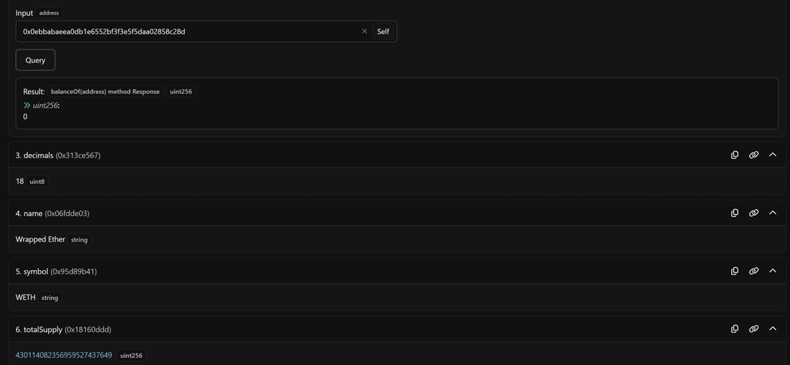
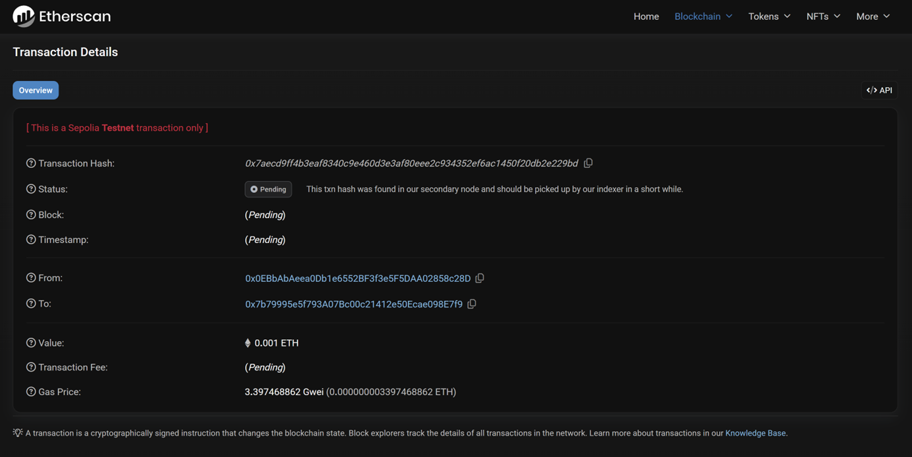
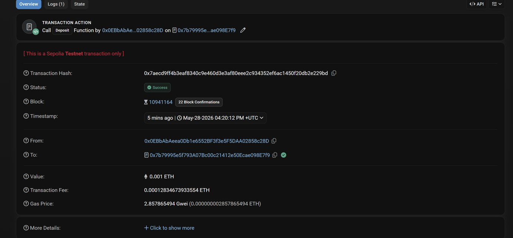
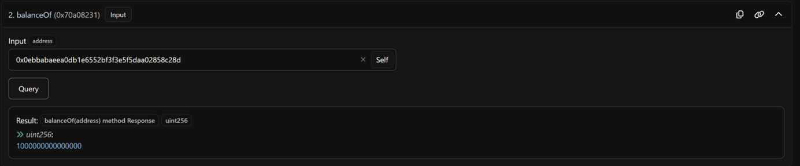
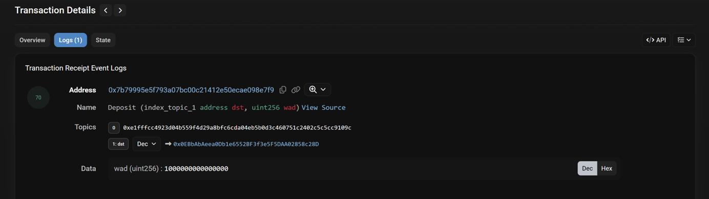
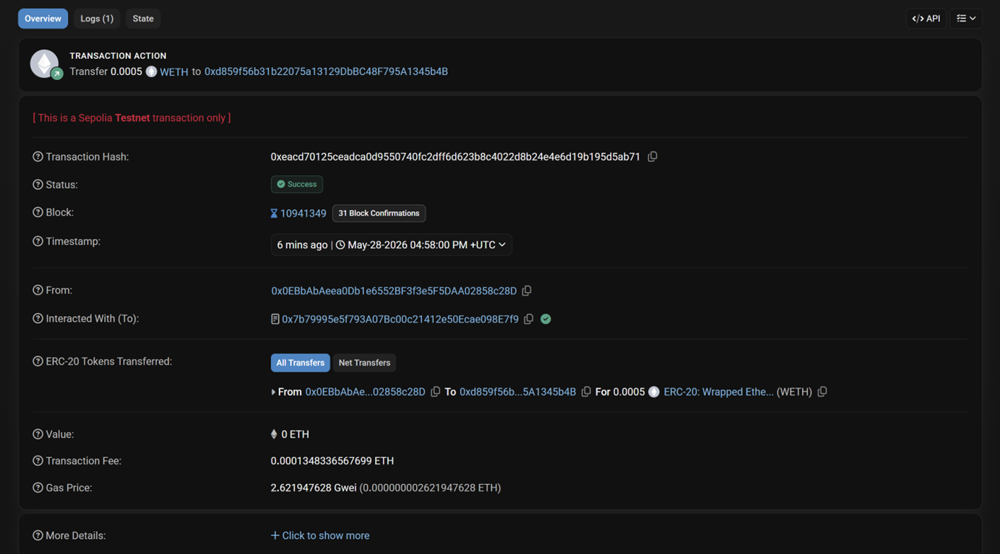
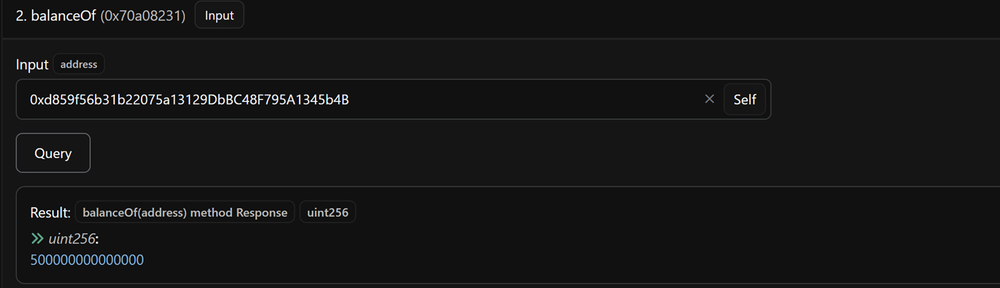

# 实验记录：WETH 合约交互

> 合约地址：`0x7b79995e5f793a07bc00c21412e50ecae098e7f9`  
> 网络：Sepolia 测试网  
> 日期：2026-05-28

---

## Step 1：Read Contract — 只读查询

### 操作

1. 打开 [WETH 合约页面](https://sepolia.etherscan.io/address/0x7b79995e5f793a07bc00c21412e50ecae098e7f9)
2. 切换「Contract」→「Read Contract」
3. 点「Connect to Web3」，连上 MetaMask（Sepolia 网络）
4. 找 `balanceOf`，输入钱包地址，点 Query

### 结果



### 理解

- Read Contract 调用的是合约里 `view` 修饰的函数
- EVM 执行了代码，但没有花 gas、没有改链上状态、不需要签名
- balanceOf 返回 0 — 还没往 WETH 里存过 ETH

---

## Step 2：Write Contract — deposit 存入 ETH

### 操作

1. 切换「Contract」→「Write Contract」
2. 找到 `1. deposit` 函数（payable，无输入参数）
3. 在 payableAmount 填 `0.0001` ETH
4. 点 Write → MetaMask 弹出 → 人工审核后确认

### 交易信息

- **Tx Hash**：`0x7aecd9ff4b3eaf8340c9e460d3e3af80eee2c934352ef6ac1450f20db2e229bd`
- 函数选择器：`0xd0e30db0` = `keccak256("deposit()")` 前 4 字节

### 截图记录

**Pending 状态：**


**Success 状态：**


**余额验证（balanceOf）：**


**事件日志（Deposit 事件）：**


### 理解

- `deposit` 是 payable 函数，ETH 作为交易的 value 附送，不是填在函数参数里
- 函数选择器 `0xd0e30db0` ≠ 合约地址，只是 keccak256 哈希的前 4 字节
- 交易经历了 pending → success，确认后状态上链
- Logs 中 emit 了 `Deposit` 事件，链下可捕捉
- balanceOf 从 0 变成 0.0001 WETH — ETH 已被包装成 ERC-20

### Logs 中 Address 与 Tx Hash 的区别

| 字段 | 值（示例） | 含义 |
|------|-----------|------|
| Tx Hash | `0x7aecd9ff...29bd` | 这笔交易的身份证号，全球唯一 |
| Address | `0x7b79995e...E7f9` | WETH 合约地址，所有跟 WETH 的交互都指向它 |

Logs 面板的结构：

```
Address     0x7b79995e5f793a07bc00c21412e50ecae098e7f9    ← 日志来源合约（永远指向 WETH）
Name        Deposit (index_topic_1 address dst, uint256 wad)
Topics[0]   0xe1fffcc4923d04b559f4d29a8bfc6cda04eb5b0d3c460751c2402c5c5cc9109c
            ↑ keccak256("Deposit(address,uint256)") — 事件签名哈希
Topics[1]   0x0EBbAbAeea0Db1e6552BF3f3e5F5DAA02858c28D
            ↑ dst（indexed 参数，你的地址）
Data        1000000000000000
            ↑ wad = 0.001 ETH（单位 wei，非 indexed 参数）
```

类比：你在 ATM 存钱，Tx Hash = 小票流水号（每笔唯一），Address = ATM 编号（固定不变）。不同人存钱 Logs 里的 Address 相同，但 Tx Hash 不同。

---

## 关键洞察：为什么 MetaMask 弹窗里 `to` 永远是合约地址

### 现象

调 `transfer(Account2, 0.0005)` 时，MetaMask 显示 `Interacted With (To): 0x7b799...E7f9`（WETH 合约地址），而不是 Account 2 的钱包地址。金额显示为「0.0005 unknown」。

### 原因

**EVM 交易模型中，`to` 字段永远填目标合约地址，具体调哪个函数、传什么参数写在 `data` 里。**

```
你的 transfer 交易：

  to:    0x7b799...E7f9    ← EVM："你要找哪个合约？"
  data:  0xa9059cbb        ← EVM："transfer(address,uint256) 的函数选择器"
         + Account2地址      ← EVM："第一个参数 dst"
         + 500000000000000   ← EVM："第二个参数 wad"

EVM 执行流程：
  1. 跳到 0x7b799...E7f9 的字节码
  2. 匹配 transfer 函数
  3. dst = Account2, wad = 500000000000000
  4. balanceOf[Account1] -= wad; balanceOf[Account2] += wad
```

如果 `to` 填 Account 2 会怎样？Account 2 是普通钱包地址，不是合约，没有 `transfer` 函数 → 交易直接失败。

### 对比

| | 普通 ETH 转账 | 合约交互（transfer） |
|---|---|---|
| to | 对方钱包地址 | **合约地址** |
| value | 你要转的 ETH | 通常为 0 |
| data | 空 | 函数选择器 + 参数 |
| 实际效果 | 对方余额 +N | 合约内部状态被修改 |

---

## Step 3：transfer — 转账 WETH 给另一个账户

### 操作

1. Account 1 已连接 Etherscan
2. Write Contract → `2. transfer`
3. `dst`：填入 Account 2 地址
4. `wad`：填入 `500000000000000`（= 0.0005 WETH）
5. 点 Write → MetaMask 弹出 → 人工审核 → 确认

### 交易信息

- **Tx Hash**：`0xeacd70125ceadca0d9550740fc2dff6d623b8c4022d8b24e4e6d19b195d5ab71`

### 截图记录

**交易详情：**


**Account 2 余额验证（balanceOf）：**


### 理解

- `transfer` 封装了底层合约调用的复杂性——dst 写在 data 字段里，不是 to 字段
- 交易成功后，WETH 合约内部 `balanceOf[Account1]` 减少，`balanceOf[Account2]` 增加
- Account 2 从未直接与合约交互，但余额已记录在链上
- Account 1 剩余 0.0005 WETH，Account 2 收到 0.0005 WETH

---

## 实验记录：部署 Simple 合约并源码验证

> 日期：2026-05-28
> 网络：Sepolia 测试网
> 工具链：Remix + MetaMask + Etherscan

### 合约源码

```solidity
// SPDX-License-Identifier: MIT
pragma solidity ^0.8.0;
contract Simple {
    uint public value;
    function set(uint _v) public { value = _v; }
}
```

### 操作步骤

1. Remix → 新建 `Simple.sol` → 粘贴合约 → 编译（Solidity 0.8.7）
2. Deploy & Run → Environment 选 Browser Extension (MetaMask) → Deploy
3. 合约部署成功 → 得到合约地址和创建交易 hash
4. 在 Remix 测试：`value()` → `0`  →  `set(42)` →  `value()` → `42` ✅
5. Etherscan 打开合约页面 → 点 Contract → Verify and Publish
6. 验证表单：Single File / v0.8.7+commit.e28d00a7 / MIT License → 粘贴源码 → 验证通过

### 部署信息

| 项目 | 内容 |
|------|------|
| **合约地址** | `0xfd9e68338AdcFE961ddcbE6D15d4A5fE01043ceB` |
| **创建交易** | `0x0f7c85869ce5e1161c85b6e0e81135da1fece38204598e7643c1d114aeb5251d` |
| **部署者** | `0x0EBbAbAeea0Db1e6552BF3f3e5F5DAA02858c28D` |
| **编译器** | Solidity v0.8.7 |
| **验证状态** | ✅ 已验证（Verified） |
| **初始 value** | `0` |
| **set(42) 后** | `42` |

### 理解

- 部署合约是一笔特殊的交易：`to` 字段为空，`data` 字段是完整的合约字节码
- Etherscan 源码验证 = 上传源码 → 用指定版本重新编译 → 比对链上字节码 ← 本质是哈希校验
- 合约部署后任何人都能调 `value()` 读最新值，通过遍历 `set()` 调用的历史交易可追溯 value 的每一次变更
- 链上数据完全公开透明，人人可查
