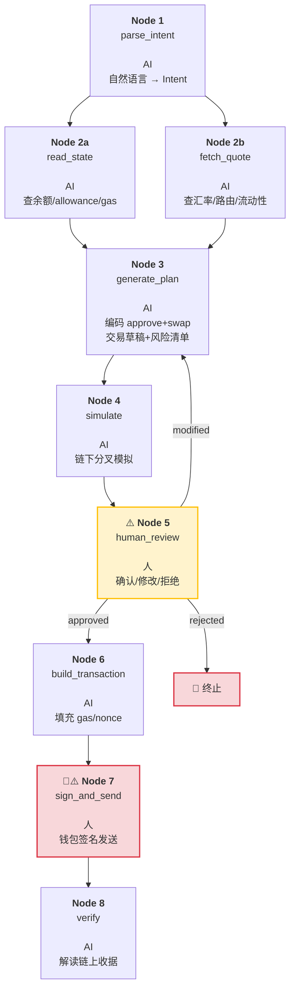
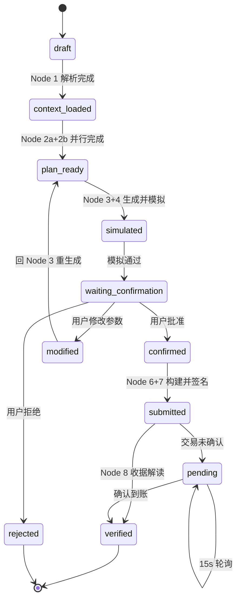

# ERC-20 Swap Workflow — 开发接口文档

> 面向实现者。设计思路与过程详见 [设计过程.md](./设计过程.md)。
> 日期：2026-05-30 | 版本：1.0

## 目录

- [1. 概述](#1-概述)
- [2. Task Graph](#2-task-graph)
- [3. State Machine](#3-state-machine)
- [4. 受限约束](#4-受限约束)
- [5. 用户输入](#5-用户输入)
- [6. 节点接口规格](#6-节点接口规格)
- [7. Retry & Fallback 边界表](#7-retry--fallback-边界表)
- [8. 人工确认点](#8-人工确认点)
- [9. 结果验证](#9-结果验证)
- [10. 风险与限制](#10-风险与限制)
- [附录 A：完整参数定义](#附录-a完整参数定义)
- [附录 B：端到端输入输出示例](#附录-b端到端输入输出示例)
- [附录 C：节点依赖关系](#附录-c节点依赖关系)
- [附录 D：Evaluation Harness](#附录-d-evaluation-harness)

---

## 1. 概述

本 Workflow 定义一个受限 AI 辅助 ERC-20 Swap 流程。AI 仅可读取链上数据、编码参数、检查结果——不可接触私钥、不可自动签名、不可绕过人工确认。目标网络：Sepolia（chainId = 11155111）。

涉及四个 Agent Workflow 核心概念：
- **Task Graph** — 8 节点有向无环图
- **State Machine** — 全局 10 状态 FSM
- **Human-in-the-loop** — Node 5 + Node 7
- **Retry & Fallback** — 每节点独立重试边界

---

## 2. Task Graph



---

## 3. State Machine

全局 FSM，10 个状态。每节点另有内部子状态（idle → working → done/failed），详见附录。



---

## 4. 受限约束

| ✅ AI 可以做的 | ❌ AI 不能做的 |
|---------------|---------------|
| 规划操作步骤 | 接触私钥/助记词/API Key |
| 编码交易参数 | 绕过人工确认 |
| 标注风险 | 自动签名 |
| 检查链上结果 | 自动转账或合约写入 |

---

## 5. 用户输入

Node 1 将自然语言解析为结构化 Intent。后续节点只接收和输出结构化数据。

| 字段 | 类型 | 必填 | 默认值 |
|------|------|:----:|--------|
| `tokenA` | address | ✅ | — |
| `tokenB` | address | — | AI 解析 |
| `amount` | uint256 | ✅ | — |
| `chainId` | uint256 | ✅ | `11155111` |
| `slippage` | uint256 | — | `50` (0.5%, bps) |
| `maxApprove` | uint256 | — | = amount |

---

## 6. 节点接口规格

### Node 1: parse_intent

```
角色: AI
输入: 自然语言
输出: {tokenA, tokenB, amount, chainId, slippage, maxApprove}
失败: 缺字段→回问; token 无法解析→列出候选
```

### Node 2a: read_state

```
角色: AI (并行)
输入: {tokenA, chainId}
输出: {balance, allowance, gasPrice}
工具: eth_call → balanceOf/allowance; gas oracle
失败: RPC 超时→切换备选(最多3); 全挂→终止
```

### Node 2b: fetch_quote

```
角色: AI (并行，与2a无依赖)
输入: {tokenA, tokenB, amount, chainId}
输出: {quote, route, liquidity, priceImpact}
工具: eth_call → Router.getAmountsOut / 聚合器 API
失败: 无路由→终止; 流动性不足→标注风险
```

### Node 3: generate_plan

```
角色: AI
输入: {intent, walletState, spotData}
输出: {approveTx: {to, data, value}, swapTx: {to, data, value}, risks: [{type, severity, detail}]}
工具: ABI 编码 + 函数选择器 + 滑点公式
失败: 签名不匹配→检查ABI; 无路由→终止

注意:
  - approveTx.to = tokenA合约, swapTx.to = Router合约
  - 只设 to/data/value (gasLimit由N4估算, gasPrice/nonce由N6补全)
  - risks[] 检测: approve-unlimited, slippage-too-high, slippage-vs-impact,
    insufficient-balance, insufficient-allowance, indirect-route, low-liquidity
```

### Node 4: simulate

```
角色: AI
输入: {approveTx, swapTx, chainId, state}
输出: {simSuccess, simResult, gasEstimate, warnings[]}
工具: Tenderly/Anvil/eth_call 批量
失败: revert→回N3; 工具全挂→跳过但标注「未经模拟」
```

### Node 5: human_review ⚠️

```
角色: 人 — AI 等待
输入: {plan, simResult, risks, route}
输出: {status: approved|modified|rejected, changes?, reason?}
失败: rejected→终止; modified→回N3; 超时→Clean up
```

确认页格式：

```
════════════════════════════════
  🔁 Swap 确认
════════════════════════════════
  📥 支付  10 USDC (0xA0b8...)
  📤 获得  ~0.00495 WETH (0x7b79...)
  🛣 路径  [USDC → WETH]  1 跳
  💧 滑点  0.5%
  ⛽ Gas    0.00015 ETH
  ✅ 模拟  通过
  ⚠️ 风险  N 项
  📋 步骤  1. approve  2. swap
  [✅ 确认]  [✏️ 修改]  [❌ 拒绝]
════════════════════════════════
```

### Node 6: build_transaction

```
角色: AI
输入: {confirmedParams, gasInfo}
输出: {tx1: {to,data,gasLimit,gasPrice,nonce}, tx2: {...}}
工具: eth_estimateGas / eth_getTransactionCount / eth_gasPrice
失败: estimateGas revert→终止
```

### Node 7: sign_and_send 🔑

```
角色: 人 — AI 不碰
输入: {tx1, tx2}
输出: {txHash1, txHash2} | 取消
工具: 用户钱包
失败: 拒签→终止; pending→进N8轮询
```

### Node 8: verify

```
角色: AI
输入: {txHash1, txHash2}
输出: {success, actualAmount, slippageActual, events[], gasUsed}
工具: eth_getTransactionReceipt + Transfer事件解码
失败: pending→15s轮询(最多5分钟); reverted→解析reason
```

---

## 7. Retry & Fallback 边界表

### 分类定义

| 分类 | 判断标准 |
|------|---------|
| **可安全重试** | 幂等读，无副作用 |
| **有条件重试** | 须先验证状态 |
| **禁止自动重试** | 涉及链上写入 |

### Node 1: parse_intent

| 场景 | 类别 | 边界 |
|------|------|------|
| AI 模型超时 | 可重试 | 退避3次(1s→2s→4s)，超→降级人工 |
| JSON 无法解析 | 可重试 | 重试2次 |
| token 名无法映射 | 不可重试 | 列候选让用户选 |
| 缺少必填字段 | 不可重试 | 回问用户 |

### Node 2a: read_state

| 场景 | 类别 | 边界 |
|------|------|------|
| RPC 超时 | 可重试 | 切换备选Provider×3，记录来源 |
| 429限流 | 可重试 | 退避3次，不切换Provider |
| 返回空数据 | 有条件 | 切换Provider交叉验证 |
| balanceOf revert | 不可重试 | tokenA无效→终止 |
| gasPrice偏差>50% | 有条件 | 交叉验证，取保守值 |

### Node 2b: fetch_quote

| 场景 | 类别 | 边界 |
|------|------|------|
| RPC 超时 | 可重试 | 同N2a |
| getAmountsOut revert | 不可重试 | 无交易对→终止 |
| 聚合器API不可用 | 有条件 | 降级: API→链上Router→终止 |
| quote=0 | 有条件 | 切换再查1次 |
| 偏离>10% | 有条件 | 3源交叉验证取中位数 |

### Node 3: generate_plan

| 场景 | 类别 | 边界 |
|------|------|------|
| AI 模型不可用 | 可重试 | 退避3次(2s→4s→8s)，超→终止 |
| ABI不匹配 | 不可重试 | 修复ABI→重新执行 |
| JSON格式错误 | 可重试 | 重试2次 |
| 编码危险参数 | 不可重试 | risks[]捕获+N4模拟+N5审核 |
| 数据矛盾 | 不可重试 | risks[]标记 |

### Node 4: simulate

| 场景 | 类别 | 边界 |
|------|------|------|
| Tenderly不可用 | 有条件 | 降级: Tenderly→Anvil→eth_call→跳过+标注 |
| 429限流 | 可重试 | 退避2次 |
| simulate revert | 不可重试 | 回N3 |
| 偏差>阈值 | 不可重试 | warnings[]→N5 |

### Node 5: human_review

| 场景 | 类别 | 边界 |
|------|------|------|
| modified | 工作流回路 | 带参数回N3 |
| rejected | 不可重试 | 终止 |
| 超时 | 不可重试 | Clean up→终止 |

### Node 6: build_transaction

| 场景 | 类别 | 边界 |
|------|------|------|
| estimateGas RPC超时 | 可重试 | 切换Provider×3 |
| estimateGas revert | 不可重试 | 终止 |
| getTransactionCount超时 | 可重试 | 切换Provider×3 |
| gasPrice RPC全挂 | 有条件 | N2a快照×1.2兜底+标注 |
| 缺少必填字段 | 不可重试 | 逻辑bug→检查上游 |

### Node 7: sign_and_send

| 场景 | 类别 | 边界 |
|------|------|------|
| 用户拒签 | 不可重试 | 终止 |
| txHash未返回 | 禁止重发 | 先查mempool/etherscan确认状态 |
| tx pending | 禁止再次发送 | 进N8轮询，不重发 |
| tx1 pending时发tx2 | 禁止 | 等tx1确认 |
| 钱包崩溃恢复 | 谨慎 | 先查链上状态再决定 |

### Node 8: verify

| 场景 | 类别 | 边界 |
|------|------|------|
| getReceipt RPC超时 | 可重试 | 切换Provider×3 |
| receipt=null (pending) | 轮询 | 15s×20次(5分钟) |
| status=0 (reverted) | 不可重试 | 解析reason→报告 |
| 事件解码失败 | 不可重试 | 检查ABI |
| 两Provider不一致 | 谨慎 | 第3个Provider交叉验证 |

### 三条黄金法则

1. **读** — RPC超时→切换Provider，记录来源
2. **写** — 不确定状态→先查链上，绝不盲目重发
3. **pending** — 轮询等待，不重发，不加速(除非人主动)

---

## 8. 人工确认点

| 确认点 | 节点 | 原因 |
|--------|:----:|------|
| 复核交易草稿 | N5 | AI可能算错 |
| 审核授权范围 | N5 | approve对象与额度不能出错 |
| 确认滑点 | N5 | 太小失败、太大被套利 |
| 钱包签名 | N7 | 私钥不在AI手里 |

AI 不可代劳：接触私钥、签名交易、自动发交易到链上、跳过 N5 进入 N6。

---

## 9. 结果验证

| 校验项 | 方法 | 执行者 |
|--------|------|:--:|
| 交易状态 | getTransactionReceipt→status=1 | AI + 人 |
| 实际成交额 | 解码Transfer.value→对比quote | AI |
| 滑点偏差 | (quote-actual)/quote | AI |
| 授权残留 | allowance(用户,Router) ≤ maxApprove | AI |
| 余额变化 | swap前后各调balanceOf | AI + 人 |

---

## 10. 风险与限制

| # | 风险 |
|:--:|------|
| 1 | AI不确定性 — 可能算错汇率/选错路由/编码错误 |
| 2 | 安全边界缺失 — 未声明约束时接近全自由Agent |
| 3 | 链上状态延迟 — N2a→N7间余额可能已变 |
| 4 | 网络依赖 — RPC不可用或过期数据 |
| 5 | 测试网限定 — 仅小额Sepolia |

---

## 附录 A：完整参数定义

### A.1 Intent (Node 1 输出)

| 参数 | 类型 | 说明 |
|------|------|------|
| `tokenA` | address | 源代币合约地址，AI 从自然语言映射 |
| `tokenB` | address | 目标代币合约地址 |
| `amount` | uint256 | 支付数量，按 tokenA decimals 精度 |
| `chainId` | uint256 | 目标链 ID，Sepolia=11155111 |
| `slippage` | uint256 | 滑点(bps)，默认50(0.5%) |
| `maxApprove` | uint256 | approve 额度上限，默认=amount。严禁 uint256.max |

### A.2 walletState (Node 2a 输出 → Node 3 输入)

| 参数 | 类型 | 说明 |
|------|------|------|
| `balance` | uint256 | 用户持有 tokenA 数量 |
| `allowance` | uint256 | 已授权 Router 的 tokenA 额度 |
| `gasPrice` | uint256 | 链上当前 gas 价格(wei) |

### A.3 spotData (Node 2b 输出 → Node 3 输入)

| 参数 | 类型 | 说明 |
|------|------|------|
| `quote` | uint256 | 池子此刻报价(tokenB 数量)，有时效性 |
| `route` | address[] | 最优路径，如 `[USDC, WETH]` |
| `liquidity` | uint256 | 池子深度(tokenA 侧) |
| `priceImpact` | float | 价格冲击 = amount/(liquidity+amount) |

### A.4 approveTx + swapTx (Node 3 输出)

| 字段 | 类型 | 说明 |
|------|------|------|
| `approveTx.to` | address | tokenA 合约地址 |
| `approveTx.data` | bytes | keccak256("approve(address,uint256)")[0:4] + ABI(spender, amount) |
| `approveTx.value` | uint256 | 0 |
| `swapTx.to` | address | Router 合约地址 |
| `swapTx.data` | bytes | swap 编码，含 path/amountOutMin/deadline |
| `swapTx.value` | uint256 | 0(非ETH→token) |
| `risks[]` | array | {type, severity, detail} |

> gasLimit 由 N4 估算，gasPrice/nonce 由 N6 补全。

### A.5 simResult (Node 4 输出)

| 参数 | 类型 | 说明 |
|------|------|------|
| `simSuccess` | bool | 模拟未 revert |
| `simResult` | uint256 | 模拟成交 tokenB 数量 |
| `gasEstimate` | uint256 | gas 消耗估算(wei) |
| `warnings[]` | array | 模拟中警告 |

### A.6 human_review (Node 5 输入/输出)

| 参数 | 类型 | 方向 | 说明 |
|------|------|:--:|------|
| `plan` | dict | 入 | N3输出 {approveTx, swapTx} |
| `simResult` | dict | 入 | N4输出 |
| `risks` | array | 入 | N3风险清单 |
| `route` | address[] | 入 | N2b路径 |
| `status` | enum | 出 | approved/modified/rejected |
| `changes` | dict | 出 | modified时: {slippage, maxApprove, ...} |
| `reason` | string | 出 | rejected时 |

### A.7 tx1/tx2 (Node 6 输出 → Node 7 输入)

| 字段 | 类型 | 说明 |
|------|------|------|
| `tx1.to` | address | tokenA 合约 |
| `tx1.data` | bytes | approve 编码 |
| `tx1.gasLimit` | uint256 | max(estimate×1.2, 21000) |
| `tx2.to` | address | Router 合约 |
| `tx2.data` | bytes | swap 编码 |
| `tx2.gasLimit` | uint256 | |
| `gasPrice` | uint256 | 链上实时值 |
| `nonce` | uint256 | 连续nonce(approve=N, swap=N+1) |

### A.8 verify 输出 (Node 8)

| 参数 | 类型 | 说明 |
|------|------|------|
| `success` | bool | 两笔都status=1 |
| `actualAmount` | uint256 | 实际到账 tokenB |
| `slippageActual` | float | (quote-actual)/quote |
| `events[]` | array | Transfer/Approval事件 |
| `gasUsed` | uint256 | 合计gas |

---

## 附录 B：端到端输入输出示例

```
输入: "帮我把 10 USDC 换成 WETH"

N1输出: {tokenA:"0xA0b8...", tokenB:"0x7b79...", amount:10000000, chainId:11155111, slippage:50, maxApprove:10000000}
N2a输出: {balance:50000000, allowance:0, gasPrice:25000000000}
N2b输出: {quote:4985000000000000, route:["0xA0b8...","0x7b79..."], liquidity:5000000000, priceImpact:0.002}
N3输出: {approveTx:{to:"0xA0b8...", data:"0x095ea7b3...", value:0}, swapTx:{to:"0x68b3...", data:"0x38ed1739...", value:0}, risks:[{type:"insufficient-allowance", severity:"中", detail:"allowance=0"}]
N4输出: {simSuccess:true, simResult:4984500000000000, gasEstimate:180000, warnings:[]}
N5: 用户确认→{status:"approved"}
N6输出: {tx1:{to:"0xA0b8...", gasLimit:220000, gasPrice:25000000000, nonce:17}, tx2:{to:"0x68b3...", gasLimit:300000, gasPrice:25000000000, nonce:18}}
N7输出: {txHash1:"0x7aec...", txHash2:"0x1b3f..."}
N8输出: {success:true, actualAmount:4984500000000000, slippageActual:0.0001, gasUsed:475000}
```

---

## 附录 C：节点依赖关系

```
Node 1 ──┬──→ Node 2a ──┬──→ Node 3 ──→ Node 4 ──→ Node 5 ──→ Node 6 ──→ Node 7 ──→ Node 8
         │  (parallel)   │                                  ⚠️                    🔑⚠️
         └──→ Node 2b ──┘                              reject → 终止      pending → N8轮询
                                                       modify → N3
```

---

## 附录 D：Evaluation Harness

测试用例详见 [`evaluation-harness.json`](./evaluation-harness.json)（23 个用例，5 类别）。

运行策略：每次修改模型/prompt/工具或节点逻辑后全类别回归。任意 FAIL → 禁止部署。
