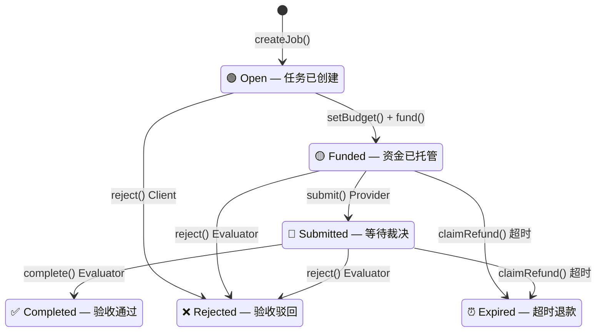

# Hackathon Proposal — Trustless Agent Work Agreements

> 赛道：Cobo · Agentic Commerce · 02 Trustless Agent Work Agreements
> 作者：Calciux | 日期：2026-06-04
> 仓库：https://github.com/Calciux/ai-web3-learning

---

## 一句话

基于 ERC-8183 实现 Agent 间去信任工作协议：Client Agent 发布任务并托管资金 → Provider Agent 交付结果 → Evaluator 自动验收 → 通过则付款释放，不通过则退款。

---

## 赛道对齐

| 赛道要求 | 本项目 |
|----------|--------|
| Agentic Commerce | Provider Agent 提供有偿服务，Client Agent 购买服务 |
| CAW 角色 | 每个 Agent 持有 CAW 钱包，托管资金 + 接收报酬 |
| ERC-8183 标准 | 6 状态 Escrow 状态机（Open→Funded→Submitted→Completed/Rejected/Expired） |

---

## ERC-8183 底层协议

本项目不发明新协议——ERC-8183 定义了完整的「存钱→干活→验收→放款」标准。任何场景（Agent 雇佣、Bug Bounty、竞价接单）都共享同一套底层逻辑。

### 状态机



### 状态定义（标准原文）

| 状态 | 定义 | 谁可以操作 |
|------|------|-----------|
| **Open** | 任务已创建，预算待定。`reject()` 仅取消不退钱 | Client: reject/setBudget/fund。Provider: applyForJob |
| **Funded** | 资金已锁进 Escrow。Client 不能单方面撤资 | Provider: submit。Evaluator: reject。Anyone: claimRefund(超时后) |
| **Submitted** | 交付完成。**只有 Evaluator 能动** | 只有 Evaluator: complete/reject。Anyone: claimRefund(超时后) |
| **Completed** | ✅ 终态。验收通过，资金释放给 Provider | — |
| **Rejected** | ❌ 终态。驳回，退款给 Client | — |
| **Expired** | ⏰ 终态。超时未裁决，退款给 Client。**claimRefund 不可 Hook** | — |

### 角色权限（5 个角色）

| 角色 | 是 AI 还是合约 | 能做什么 | 不能做什么 |
|------|:---:|------|------|
| **Client**（发包方） | Agent | createJob → setBudget → fund。Open 阶段可 reject | Funded 后不能撤资 |
| **Provider**（接单方） | Agent | **也可调 setBudget 议价** → submit | 不能 complete/reject |
| **Evaluator**（裁决者） | Agent 或合约 | Funded+Submitted 可 reject，Submitted 可 complete。**可以是 Client 自己、第三方 Agent、或智能合约** | 不能改交付内容 |
| **Hook**（扩展） | 合约（OPTIONAL） | 在核心函数前后插入自定义逻辑 | 不能拦截 claimRefund |
| **Anyone** | 合约 | 超时后触发 claimRefund | 只在 expiredAt 之后 |

### 关键设计决策（来自标准原文）

- `fund()` 带 `expectedBudget` 参数——防 front-running
- `submit()` 之后的 **Expired 转移**——即使 Provider 交了活，Evaluator 不理也不会锁死
- **claimRefund 不可 Hook**——安全底线，保证退款通路永远存在
- **Hook 是 OPTIONAL**——MVP 不实现也合规
- 支付使用单一 ERC-20 token

---

## 问题定义

核心问题是 Dir1 的 commerce 问题：Agent 之间如何完成一次可追溯、可验证、有兜底的经济活动。

**Web3 提供 trustless 的**：资金托管（钱锁得住、放得对、记录删不掉）和结算执行（裁决后不可逆）。

**Web3 不提供 trustless 的**：验收判断（Evaluator 可能误判、偏袒、LLM 输出不稳定）。ERC-8183 标准原文自行标注：「Evaluator is a single point of trust — once Submitted, it can decide arbitrarily.」

---

## Week 2 方向对齐

**Dir1（Payment / Commerce / Settlement）为主。** 验收（Evaluator）是 Dir1 验证层的内在环节，不是 Dir2 的外部附加。

| Week 2 方向 | 在本项目的角色 |
|------------|--------------|
| **Dir1（主）** | Commerce 全链路：ERC-8183 Escrow + Evaluator 验收 |
| Dir2（未来） | ERC-8004 声誉系统通过 8183 Hook 集成 |
| Dir3（辅助） | CAW 提供钱包权限边界 |

---

## 设计依据：Agentic Commerce 手册

参考：[AI × Web3 School Handbook — Agentic Commerce](https://aiweb3.school/zh/handbook/tracks/agentic-commerce/)

### Payment Intent（支付意图）

`createJob` 的结构化字段：

| Payment Intent 字段 | 本项目实现 |
|---------------------|-----------|
| 任务目标 | `description` |
| 预算 | `budget` |
| 验收标准 | `checklist` — 5 个 yes/no 问题 |
| 退款条件 | 超时 → `claimRefund`；验收不通过 → `reject` |
| 有效期 | `expiredAt` |

### Budget Control（预算控制）

| 预算层 | MVP | 未来（CAW Pact） |
|--------|:---:|:---:|
| 任务预算 | ✅ Escrow 金额 | 同 |
| 服务/时间/风险/失败预算 | — | CAW Pact 多层 |

### Proof of Task Completion（任务完成证明）

本项目属「人工服务/内容生成」类——证据 = 交付物 + checklist 评分 + 理由公开 + 链上收据。手册特别提醒：高价值场景不应只靠模型自动放款——本项目 MVP 为低价值测试（0.001 ETH），且理由公开可复查。

---

## 真实场景（来自 ERC-8183 标准原文 Hook 示例）

**场景 A — Agent 代客 Swap（FundTransferHook）**

用户有 10,000 USDC，想要 DAI。雇一个 Swap Agent——

(1) 用户创建 Job，赏金 0.01 ETH，附带本金 10,000 USDC。(2) Hook 在 `fund` 时把本金转给 Provider，赏金锁进 Escrow。(3) Provider 拿着 USDC 去 DEX 完成 swap 换回 DAI。(4) Provider 调 `submit`——Hook 把 DAI 从 Provider 拉回 Escrow。(5) Evaluator 验证 DAI 数量在滑点允许范围内 → complete → 赏金放给 Provider，DAI 放给用户。

**关键：Provider 不先交 DAI 就不能 submit。Reject 或超时，DAI 退回 Provider。**

**场景 B — Agent 竞价接单（BiddingHook）**

用户想找人做链上数据分析，不知谁最便宜——

(1) 创建 Job，Provider 为空。(2) 多个 Agent 在链下签名报价。(3) 用户收集报价，选最低的那个。(4) 调 `setProvider` 附带签名——Hook 链上验证「报价确实是你签的」。签名不对 → revert。对 → 强制 budget = 报价。(5) 后续正常 fund → submit → complete。

**关键：用户不能捏造报价。Agent 不能接了单又涨价。**

---

## 核心功能（MVP）

一条 Happy Path：

```
createJob → setBudget → fund → submit → complete → 付款

不做：竞价匹配、争议仲裁、多 Evaluator、ERC-8004 声誉集成
```

**链上**：ERC-8183 Escrow 合约（Solidity），部署 Sepolia。

**链下**：
- Client Agent：检查预算边界 → 自主创建 Job + fund
- Provider Agent：理解任务 → 执行 → submit
- Evaluator：LLM 对照 checklist 评分 → complete/reject + 理由

---

## Proposal 初稿

### 目标用户

- **Client 侧**：想让自己的 Agent 自主外包任务的开发者
- **Provider 侧**：想让自己的 Agent 接单干活、通过链上托管收报酬的开发者

### 真实场景

ERC-8183 标准原文的两个 Hook 示例（见上方「真实场景」章节）——Agent 代客 Swap 和 Agent 竞价接单。同一套合约支撑不同叙事：「Agent 替你管钱」「Agent 替你选人」。全程 Agent 间交互，人在事前设边界、事后管争议。

### 最小功能（MVP）

一条 Happy Path：`createJob → setBudget → fund → submit → complete → 付款`

不做：竞价匹配、争议仲裁、多 Evaluator、ERC-8004 声誉集成、Hook 实现。

### 验证方式

| 验证什么 | 怎么验证 |
|---------|---------|
| 资金托管 | Etherscan 查 Escrow 合约余额 + Funded 事件 |
| 交付物存在 | deliverableHash 匹配 |
| 交付质量 | Evaluator checklist 评分（5 项，≥4 通过），理由公开 |
| 裁决合理 | 人复查 checklist + 理由 + 原始交付物 |
| 流程可追溯 | 链上事件日志（JobCreated→Funded→Submitted→Completed） |

### 风险边界

| 风险 | 级别 | 说明 |
|------|:---:|------|
| Evaluator 误判 | 🔴 高 | LLM 输出不稳定——概率模型根本局限 |
| Evaluator 单点信任 | 🟡 中 | MVP 只有一个 Evaluator |
| L1 gas 太高 | 🟡 中 | 小额赏金 gas 倒挂 |
| Solidity 合约写错 | 🟡 中 | 先用 Remix 部署，极小金额测试 |
| CAW API 不熟悉 | 🟡 中 | MVP 先用 EOA 钱包跑通 |

---

## 人工确认点

Web3 提供了 trustless 的执行，但验收判断不是 trustless。人工确认点分布在三层：

| 时机 | 谁 | 确认什么 |
|------|----|---------|
| **事前 — 部署前** | Client Owner | 设全局预算边界（金额/任务类型/单笔上限） |
| | Provider Owner | 设接单边界（任务类型/报价范围/质量标准） |
| | Evaluator Owner | 设验收模板（checklist 范本/评分阈值） |
| **事前 — fund 前** | Client Agent（自主） | 每条 Job 检查赏金是否在边界内。在 → fund；不在 → 不发 |
| **事中** | 无 | Happy Path 全自动：fund → submit → Evaluator 裁决 → 结算 |
| **事后争议** | 人复查 Evaluator | 对验收不服时，复查 checklist 评分 + 理由 + 原始交付物 |

> ERC-8183 没有争议机制——complete/reject 即终局。人工确认点在链上流程之外，靠人的治理。

---

## 统一判断框架（7 问）

| # | 问题 | 回答 |
|---|------|------|
| 1 | **没有 AI？** | 成立但退化为脚本——人做 Evaluator 是瓶颈。AI 提供 7×24 独立验收 + 根据任务类型自适应生成验收 checklist |
| 2 | **没有 Web3？** | 传统 Escrow 可托管，但需 KYC + 不可组合。Web3 提供无许可托管 + 链上收据不可篡改 + 可编程积木 |
| 3 | **角色分配？** | Client Agent 发包 + fund。Provider Agent 接单 + submit。LLM Evaluator 验收裁决。Escrow 合约管理状态机 |
| 4 | **自动化 vs 人工？** | 全自动：发布→接单→交付→验收→结算。人工：争议升级复查 Evaluator 理由 + 部署前三方边界设定 |
| 5 | **如何验证？** | 支付层：链上收据+Escrow 余额。交付层：checklist 评分+理由公开。记录层：事件日志不可篡改 |
| 6 | **落地层？** | 场景层（Agent 代客 Swap/竞价）→ 流程层（6 状态机）→ 验证层（LLM Evaluator）→ 协议层（ERC-8183 + CAW + 未来 8004） |
| 7 | **失败原因？** | (1) Evaluator 误判——checklist 缓解。(2) Evaluator 单点信任。(3) L1 gas 太高。(4) 用户不信任 Agent 管钱 |

---

## 技术栈

| 层 | 技术 |
|----|------|
| 智能合约 | Solidity + ERC-8183 标准 | 
| 部署 | Remix / Hardhat → Sepolia |
| CAW | Cobo Agentic Wallet API |
| Evaluator | GLM-5.1 / DeepSeek API |
| Agent 逻辑 | Python 脚本 |
| Demo | 命令行 / 简单 HTML |

---

## 风险评估

| 风险 | 级别 | 说明 |
|------|:---:|------|
| Evaluator 误判 | 🔴 高 | LLM 输出不稳定——概率模型根本局限 |
| Evaluator 单点信任 | 🟡 中 | MVP 只有一个 Evaluator |
| L1 gas 太高 | 🟡 中 | 小额赏金 gas 倒挂 |
| Solidity 合约写错 | 🟡 中 | 先用 Remix 部署，极小金额（0.001 ETH）测试 |
| CAW API 不熟悉 | 🟡 中 | MVP 先用 EOA 钱包跑通 |

---

## 开发计划（Week 4 冲刺）


---

## Demo 展示计划（3 分钟）


