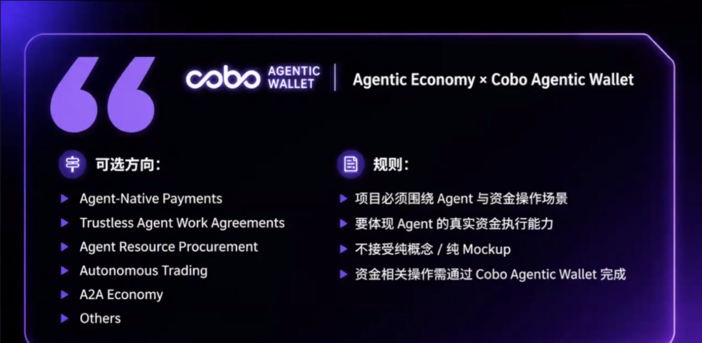
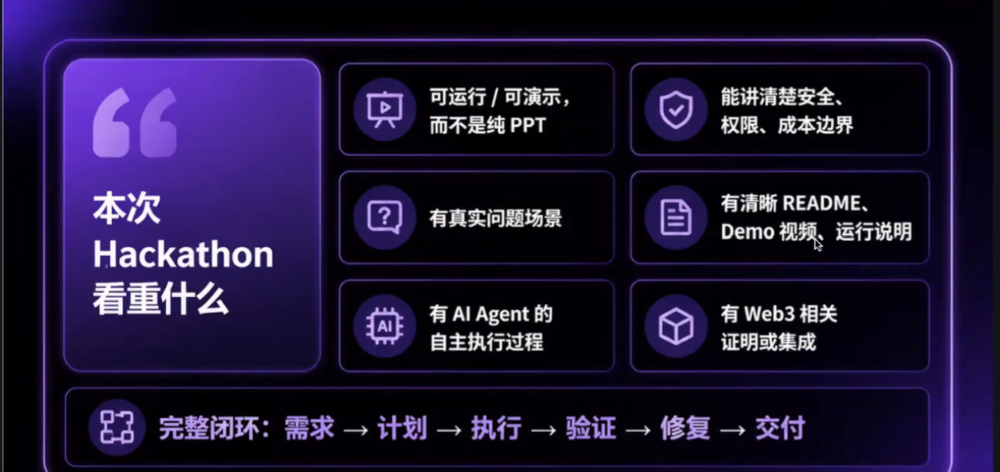

# OpenDay

## cobo向任务
- agent开始参与真实的经济活动, 开始碰到钱包/资产/权限/风控,安全/可控/可审计
- 闭环:用户提需求->agent理解任务->系统给出边界->agent在边界中完成操作
- 回答清楚:为什么一定需要agent/web3/中心化系统做不到?
- 一旦需要操作资产:谁有权/什么条件/出了事情怎么办
- 关注真实问题做透
- agent economy x cobo agentic wallet
  + agent管理资金/支付/交易/结算

## 评审维度
| 评分维度 (Criteria)          | 分值 (Points) | 说明 (Explanation)                                                                 |
|------------------------------|---------------|------------------------------------------------------------------------------------|
| Innovation 创新性            | 10            | 项目的创新性，是否提出了新的机制、流程、应用方式或问题解决                         |
| Technical Execution 技术实现 | 10            | 技术实现完成度，核心功能是否可运行，架构是否清晰                                   |
| User Experience 用户体验     | 10            | 产品体验是否完整，用户路径是否清楚，交互是否顺畅                                   |
| Ecosystem Impact 生态影响    | 10            | 项目是否具备后续发展潜力，是否能为对应生态带来价值                                 |
| Demo Quality 演示质量        | 10            | 现场演示是否稳定、清晰、有说服力，问答表现是否充分                                 |

## cobo可选方向

## hackathon要求

