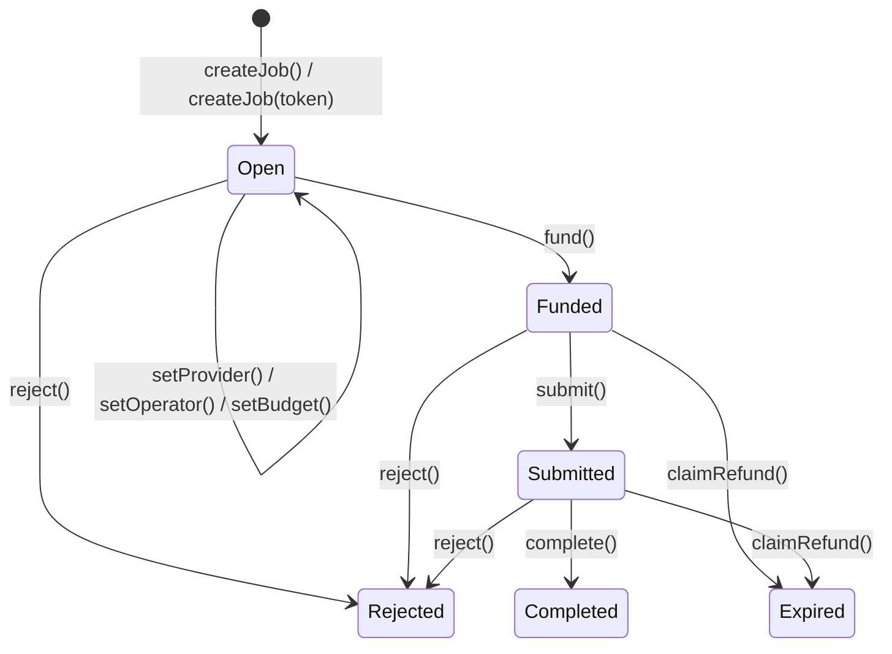

# NotebookLM PPT 生成 Prompt — Trustless Agent Work Agreements

> 请根据以下素材生成一份 Hackathon Demo PPT，中文为主，关键术语保留英文。
> 风格：简洁、证据驱动。

---

## Slide 1: 封面

- 项目名：Trustless Agent Work Agreements
- 副标题：AI Agent 间的去信任经济协议--based on ERC-8183
- 赛道：Cobo · Agentic Commerce 
- 作者：Calciux

---
## Slide 2:Agent需要的不仅仅是一个钱包
以problem-solution的方式呈现
|Problem|Solution|
|-----|------|
|Agent间的任务上链与托管支付|**ERC-8183**<br>Trust minimized payment for agent-provided work by standardizing a simple escrow.|
|钱包的安全边界与自动化能力|**Cobo Agentic Wallet**<br>(2 bullet items)- 通过Pact人工审阅权限;2.自动化签名过程,且Agent拿不到私钥|
|自动化业务流程|**AI Agent**<br>理解业务需求,填写Pact,代替人跑完业务流程|
---
## Slide 3:ERC-8183  Agentic Commerce
- 副标题:Job escrow with evaluator attestation for agent commerce.
- ERC-8183的state machine

- Hook机制:在ERC8183的有限自动机状态转移函数中随时可以去执行自定义合约
- Architecture
```
┌──────────────────────────────────────────────────────────┐
│                    Streamlit Frontend                    │
│                   自然语言输入 → 实时进度                  │
└──────────┬──────────────────┬──────────────────┬─────────┘
           │                  │                  │
    ┌──────▼──────┐   ┌──────▼──────┐   ┌──────▼──────┐
    │ Client Agent│   │Provider Agent│   │Evaluator    │
    │ 发包+托管    │   │ 接单+提交    │   │ LLM验收裁决  │
    └──────┬──────┘   └──────┬──────┘   └──────┬──────┘
           │                  │                  │
    ┌──────▼──────────────────▼──────────────────▼──────┐
    │              Cobo CAW (Agentic Wallet)             │
    │      Pact 策略 → 审批 → 执行 → 3 钱包隔离           │
    └──────────────────────┬────────────────────────────┘
                           │
    ┌──────────────────────▼────────────────────────────┐
    │            ERC-8183 Escrow (Sepolia)               │
    │         createJob → fund → submit → complete       │
    │                + SimpleSwapHook                    │
    └───────────────────────────────────────────────────┘
```

## Slide 4:Demo
- 场景:一个Swap任务
|测试链|Sepolia|
|TTK|自己部署的测试代币(ERC20),这里用来Client向Provider支付报酬|
|Client|发布Swap任务|
|Provider|两个Providers竞价,规则简单设定为价低者得|
|Evaluator|裁决任务是否成功完成|
|合约|ERC-8183有限自动机流转|
|Hook|在setProvider()函数(Client设定谁来接单)时转去执行竞价合约|


[待续]
