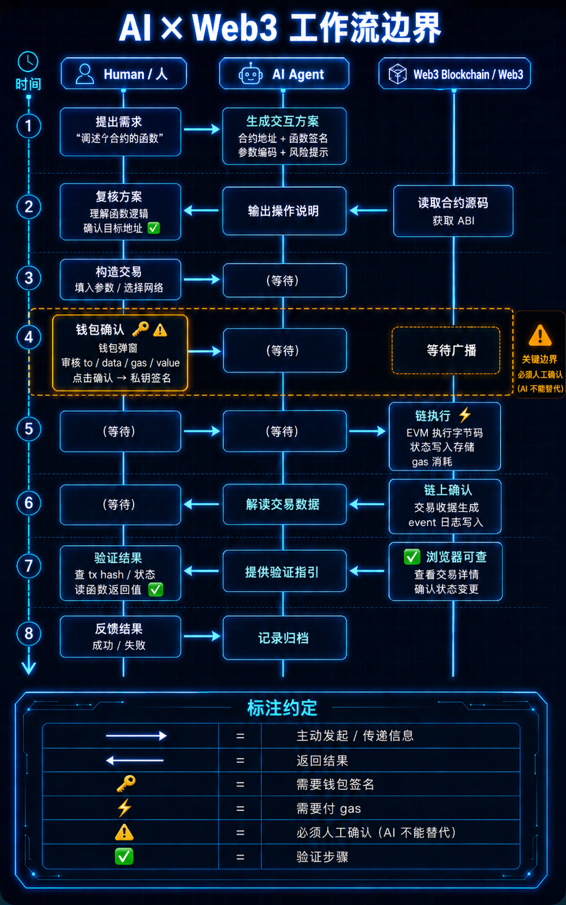

# Week 1 — AI × Web3 综合任务：画出 AI × Web3 最小交叉流程图

> 目标：理解 AI 系统和链上操作之间的边界，标注谁发起、谁执行、谁签名、谁验证。
>
> **声明：** 本文档的时序图内容由我（Calciux）提供并复核修改，输出结构和生图 prompt 由 Hermes Agent 完成，图片由 OpenAI Image 2 生成。



---

## 三列泳道：人 / AI Agent / Web3

时序图（计算机网络协议风格）：

```   
时间                                                              
 │                                                              
 │     人 (Human)              AI Agent                 Web3      
 │                                                              
 │       │                      │                        │      
 ├───  提出需求 ─────────►  生成交互方案 ───────────►    │      
 │      "调这个合约的函数"     合约地址 + 函数签名          │      
 │                           参数编码 + 风险提示           │      
 │       │                      │                        │      
 ├───  复核方案 ◄────────── 输出操作说明 ◄─────────  读取合约源码
 │      理解函数逻辑                    │               获取 ABI    
 │      确认目标地址 ✅                 │                       
 │       │                      │                        │      
 ├───  构造交易 ─────────────►  (等待) ───────────────►   │      
 │      填入参数 / 选择网络                   │                   │      
 │       │                      │                        │      
 ├───  钱包确认 🔑⚠️ ─────────►  (等待) ───────────────►   │      
 │      钱包弹窗                                  │                   │      
 │      审核 to / data / gas / value              │                   │      
 │      点击确认 → 私钥签名                       │                   │      
 │       │                      │                        │      
 ├───  (等待) ────────────────►  (等待) ───────────────►  链执行 ⚡
 │                                                         EVM 执行字节码
 │                                                         状态写入存储
 │                                                         gas 消耗
 │       │                      │                        │      
 ├───  (等待) ◄─────────────── 解读交易收据 ◄──────────  链上确认
 │                                                         交易收据生成
 │                                                         event 日志写入
 │       │                      │                        │      
 ├───  验证结果 ◄───────────── 提供验证指引 ◄─────────   ✅ 浏览器可查
 │      查 tx hash / 状态                    │           查看交易详情
 │      读函数返回值 ✅                                   确认状态变更
 │       │                      │                        │      
 ├───  反馈结果 ─────────────►  记录归档 ──────────────►   │      
 │      "成功 / 失败"            写入实验日志                │      
 │                             commit & push               │      
 │       │                      │                        │      
```

---

## 标注约定

| 符号 | 含义 |
|------|------|
| `────►` | 主动发起 / 传递信息 |
| `◄────` | 返回结果 |
| `🔑` | 需要钱包签名 |
| `⚡` | 需要付 gas |
| `⚠️` | 必须人工确认（AI 不能替代） |
| `✅` | 验证步骤 |

---

## 要素对照表

| 要素 | 在流程中的位置 |
|------|---------------|
| **谁发起任务** | **人**——提出需求（"调这个合约的某某函数"） |
| **谁执行** | AI 生成交互参数和说明；人构造交易和签名；链执行字节码 |
| **哪一步需要钱包签名** | 钱包弹窗那一步——人工审核 to/data/gas/value 后私钥签名 |
| **哪一步需要付款/gas** | 交易发送到链上时消耗 gas |
| **哪一步必须人工确认** | 复核交互参数 + 钱包签名——AI 无法代签，私钥不在 AI 手里 |
| **如何验证结果** | 区块浏览器查 tx hash、交易状态、函数返回值、事件日志 |
| **主要风险点** | ① AI 可能生成正确但用户无法验证的信息 —— 输出看似专业但实际有误，用户缺乏能力识别 |
② AI 可能遗漏关键风险 —— 未提示 approve 的权限风险、未分析合约升级的副作用 |
③ AI 可能输出钓鱼或恶意合约地址 —— 攻击者可操控 AI 推荐虚假目标 |
④ 用户未给 AI 设定安全边界 —— 未约束 AI 的行为范围（如只读、限额、白名单地址），导致 AI 提供了不应由 AI 处理的建议 |
⑤ AI 上下文丢失 —— 跨轮对话中遗忘关键约束条件，产生不一致的建议 |

---

## 三条核心边界

```
  人 ←→ AI 的边界：    AI 可以生成、解释、总结
                      但「理解并确认」必须是人来做
                      人负责判断 AI 输出的正确性和安全性

  AI ←→ 链的边界：     AI 不能直接发交易
                      所有链上操作必须经过人的私钥签名
                      AI 无法支付 gas、无法授权、无法部署合约

  人 ←→ 链的边界：     人用钱包（MetaMask / Safe / 任何私钥管理器）签名
                      人自己查区块浏览器验证链上结果
                      AI 可以提供解读，但不能替你看
                      签名前永远是人最后的防线
```

---

## 可选的生图方向

如果要用 image2 或其他 AI 作图工具生成可视化版本，参考以下描述：

> 三列竖向泳道图（左：Human / 中：AI Agent / 右：Web3 Blockchain）。
> 箭头从左到中再到右，再折返，模拟计算机网络时序图。
> 标注 🔑 钱包签名、⚡ gas 消耗、⚠️ 人工确认、✅ 验证。
> 风格：深色背景 + 霓虹蓝/青色线条，技术感。
> 标题：AI × Web3 工作流边界
