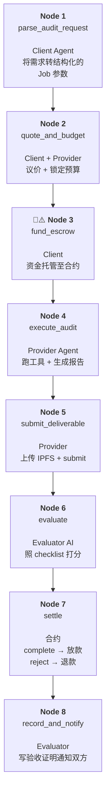

# Week 2 Module B — 最小 Payment / Commerce Flow 设计

> 场景：Agent 帮人完成链上安全审计并收款
> 作者：Calciux | 日期：2026-06-12
> 课程：AI × Web3 School Bootcamp Week 2 — Module B
> 关联：Hackathon Cobo 02 — Trustless Agent Work Agreements（ERC-8183）

---

## 〇、场景选择：Agent 做链上安全审计

**一句话**：合约开发者部署新合约前，雇一个审计 Agent 做快速安全扫描（不代替专业审计，但能快速拦掉常见漏洞）。Agent 扫描完后提交报告，由独立的 Evaluator Agent 验收，通过则自动放款。

选择这个场景的原因：

| 维度 | 说明 |
|------|------|
| **Agent 天然优势** | 静态分析、模式匹配、Slither/Mythril 等工具跑一遍是确定性的机械化劳动，LLM 还能额外解释漏洞原理和修复建议 |
| **验收可 checklist 化** | 审计报告可以拆成固定维度（覆盖了哪些漏洞类型、每项是否有证据、是否有 false positive 标注），Evaluator LLM 容易量化打分 |
| **价值明确** | 几百行 Solidity 的快速扫描是有市场需求的（Rekt 新闻太多），用户愿意为这个付费 |
| **直接复用 ERC-8183** | Client 发包 → Provider 执行 → Evaluator 验收 → 放款/退款，完整覆盖 5 角色 6 状态状态机 |

### 参与方

| 角色 | 身份 | 做什么 | 不能做什么 |
|------|------|--------|-----------|
| **Client** | 合约开发者 | 发布审计任务、设预算、托管赏金 | 资金托管后不能单方面撤资 |
| **Provider** | 审计 Agent | 理解任务要求 → 跑静态分析工具 → 生成审计报告 → 提交 | 不能裁决自己的交付 |
| **Evaluator** | 独立的验收 Agent 或人 | 对照 checklist 验收报告质量 → complete/reject | 不能修改交付内容，只能判过/不过 |
| **任何人（超时兜底）** | 合约机制 | 超时后触发 `claimRefund` 退款 | 只能在过期后调用 |

---

## 一、Module B 四层框架分析

### 1.1 场景层 —— Agent 买的是什么

**不是「买一段文本」，而是买「对代码安全的确定性判断」**。

| 隐含交付物 | 说明 |
|-----------|------|
| 漏洞清单（含严重等级、代码位置、影响范围） | 核心价值——发现什么、有多严重 |
| 修复建议 | 增量价值——告诉用户怎么修 |
| 未发现漏洞的声明 | 缺失时更难（Evaluator 无法证明没发现的东西不存在） |

明确「买的是什么」决定验收方式：审计报告可以部分自动验证（工具输出可复现），但「是否所有漏洞都找到了」无法自动证明。这支撑了下文 Evaluator 只验报告质量、不验全面性的设计决定。

### 1.2 流程层 —— 完整链路图

```
发现 → 报价 → 预算授权 → 执行 → 交付 → 验收 → 付款 / 退款 / 争议
```

| 阶段 | 谁做什么 | 链上/链下 |
|------|---------|:--------:|
| **发现** | Client 发布审计任务需求（合约地址、关注点） | 链下（市场/消息） |
| **报价** | Provider 查看需求 → 报价 X ETH；Client 接受或还价 | 链下 + 链上 `setBudget` |
| **预算授权** | Client 调用 `fund()` 将赏金锁进 Escrow | 链上 |
| **执行** | Provider 下载合约源码 → 跑 Slither/Mythril → 生成报告 | 链下 |
| **交付** | Provider 将报告存 IPFS → `submit(ipfsHash)` | 链上 |
| **验收** | Evaluator 读报告 → 照 checklist 打分 → `complete()` 或 `reject()` | AI 链下评估，签名上链 |
| **付款** | Evaluator `complete()` → 资金释放给 Provider | 链上 |
| **退款** | Evaluator `reject()` → 资金退回 Client | 链上 |
| **争议** | Client 不服验收结果 → 人工复查 Evaluator 理由 | 链下 |

### 1.3 验证层 —— 谁验、验什么、争议谁管

| 验证对象 | 如何验证 | 验证者 | 自动/人工 |
|---------|---------|--------|:--------:|
| 交付物存在 | `submit()` 时记录的 ipfsHash 可下载 | 任何人 | 自动 |
| 报告格式 | 是否包含漏洞清单+修复建议两个必选章节 | Evaluator | 自动（结构化检查） |
| 报告质量 | 5 项 checklist（见下文）≥ 4 项通过 | Evaluator AI | 自动 |
| 裁决合理 | 复查 Evaluator 给分的理由 + 对比交付物 | 人（争议时） | 人工 |
| 资金状态 | 查 Escrow 合约余额 + 链上事件 | 任何人 | 自动 |

**验收 checklist（Evaluator 用的 5 项标准）**：

| # | 检查项 | 权重 |
|:-:|-------|:---:|
| 1 | 报告明确列出了发现的漏洞（含代码位置 + 严重等级） | 35% |
| 2 | 每个漏洞附了具体证据（工具输出片段或代码引证） | 25% |
| 3 | 报告标注了 false positive 风险 | 15% |
| 4 | 给出了可操作的修复建议 | 15% |
| 5 | 报告结构完整、无明显矛盾或缺失 | 10% |

评分机制：≥ 4 项 Yes → `complete()`；≤ 3 项 Yes → `reject()`（理由是链上公开的，不服可人工复查）。

### 1.4 协议层 —— 选什么标准

| 协议 | 解决本场景的哪一段 |
|------|------------------|
| **ERC-8183** | 托管状态机 + 角色权限 + 资金释放。本设计的骨架——没有它就没有 trustless 的「先锁钱→后交付→第三方裁决」 |
| **ERC-8004** | 验收通过后写声誉记录到链上注册表。本场景中 Client 可以查 Provider 的历史审计记录来选人 |
| **x402** | HTTP 402 微支付触发——不适用于本场景（审计是一次性交付，不是按次 API 调用） |
| **MPP** | 机器间批量支付路由——不适用于本场景（单笔托管，不需要路由） |

---

## 二、最小 Payment / Commerce Flow — Task Graph



### 节点总览

| 节点 | 名称 | 执行者 | 关键动作 | 是否自动 |
|:----:|------|:-----:|---------|:-------:|
| 1 | parse_audit_request | Client Agent | 自然语言需求 → 结构化 Job 参数 | ✅ 自动 |
| 2 | quote_and_budget | Client + Provider | 报价/还价 → `setBudget()` | ✅ 自动 |
| 3 | fund_escrow 🔑⚠️ | Client | `fund()` — 资金进入托管 | ❌ 需签名确认 |
| 4 | execute_audit | Provider Agent | 跑静态分析工具 → 撰写报告 | ✅ 自动 |
| 5 | submit_deliverable | Provider | IPFS 上传 → `submit(ipfsHash)` | ✅ 自动（签名触发） |
| 6 | evaluate | Evaluator AI | 读报告 → 5 项 checklist 打分 | ✅ 自动 |
| 7 | settle | 合约 | `complete()` 放款 / `reject()` 退款 | ✅ 链上确定性 |
| 8 | record_and_notify | Evaluator | 上链验收证明 → 通知双方 | ✅ 自动 |

---

## 三、节点详细规格

### Node 1: parse_audit_request

| 项目 | 内容 |
|------|------|
| **执行者** | Client Agent（发包 AI） |
| **输入** | 自然语言需求：`"帮我审计一下 0x7b79... 这个合约，重点关注重入和闪电贷攻击"` |
| **输出** | `{contractAddress, chainId, focusAreas[], maxBudget, deadline}` |
| **工具** | AI 语义解析 + 地址校验 |
| **失败处理** | 合约地址无效 → 回问；缺少 deadline → 设默认 7 天 |

| 输出字段 | 类型 | 含义 |
|---------|------|------|
| `contractAddress` | address | 待审计合约地址 |
| `chainId` | uint256 | 合约部署的链 |
| `focusAreas` | string[] | 重点关注方向（如 `["reentrancy", "flashloan"]`） |
| `maxBudget` | uint256 | 客户端愿意支付的最高赏金 |
| `deadline` | uint256 | Provider 提交的截止时间戳 |

### Node 2: quote_and_budget

| 项目 | 内容 |
|------|------|
| **执行者** | Client Agent + Provider Agent |
| **输入** | `{contractAddress, focusAreas, maxBudget}`（来自 Node 1 的派单）+ Provider 报价 |
| **输出** | `{budget, provider, acceptedTerms}` |
| **工具** | Client Agent 调 `setBudget()` / Provider Agent 签名报价 |
| **失败处理** | Provider 报价 > maxBudget → 拒绝或还价；无 Provider 接单 → 超时取消 |

**流程**：Client Agent 把需求发给市场 → 多个 Provider Agent 链下报价 → Client Agent 自动选最低价或指定 Provider → 双方确认 → `setBudget()` 锁定预算金额在合约中。

**设计意图**：这一步将「报价」从链下协商转化为链上状态。只有 `budget` 被 `setBudget()` 设置后，`fund()` 才能触发。如果双方谈不拢，状态停留在 Open，任何人都可以 `claimRefund`（实际上没存钱所以纯取消）。

### Node 3: fund_escrow 🔑⚠️

| 项目 | 内容 |
|------|------|
| **执行者** | **Client**（资金持有方） |
| **输入** | `{budget}`（Node 2 确定的金额）|
| **输出** | Funded 链上事件 |
| **工具** | Client 调用 Escrow 合约的 `fund()`，附带 ETH |
| **失败处理** | 余额不足 → 交易 revert；gas 不够 → 提示补充 gas |

**⚠️ 关键确认点**：
- Client 需要确认：金额 = Node 2 约定的 budget
- 确认目标 Provider 地址正确
- 确认 Evaluator 地址已设置且可信

**设计意图**：这是资金从 Client 钱包迁移到合约保险箱的一步。一旦 `fund()` 成功，Client 无法单方面要回。也是整个 flow 中**唯一一次实际资产转移**。这里出问题就是真金白银的损失，所以必须人工复核。

### Node 4: execute_audit

| 项目 | 内容 |
|------|------|
| **执行者** | Provider Agent（审计 AI） |
| **输入** | `{contractAddress, chainId, focusAreas}` + 链上源码 |
| **输出** | 审计报告（结构化 JSON + 自然语言摘要） |
| **工具** | Slither / Mythril / 源码下载 |
| **失败处理** | 源码不可验证（非开源）→ 标记并只做 bytecode 级检查；工具崩溃 → 重试 3 次后放弃 |

**Provider Agent 输出报告格式**：

```json
{
  "contractAddress": "0x...",
  "tools": ["slither", "mythril"],
  "findings": [
    {
      "type": "reentrancy",
      "severity": "high",
      "location": "withdraw(): line 42-58",
      "evidence": "Slither: ...",
      "fix": "Add Checks-Effects-Interactions pattern"
    }
  ],
  "falsePositives": ["finding #2 is a known won't-fix"],
  "noVulnerabilitiesFound": false
}
```

### Node 5: submit_deliverable

| 项目 | 内容 |
|------|------|
| **执行者** | Provider（接单 Agent） |
| **输入** | 审计报告文件 |
| **输出** | `{ipfsHash, txHash}` — Chain Submitted 事件 |
| **工具** | IPFS 上传 + `submit(ipfsHash)` |
| **失败处理** | IPFS 不可用 → 备选去中心化存储；submit 失败 → 重试 |

### Node 6: evaluate

| 项目 | 内容 |
|------|------|
| **执行者** | Evaluator（验收 AI） |
| **输入** | 审计报告（从 IPFS 下载）+ 验收 checklist |
| **输出** | `{passed: bool, scores: {}, reason: string}` |
| **失败处理** | IPFS 读不到 → 等待并重试；报告格式异常 → `reject()` + 注明原因 |

**Evaluator 打分输出示例**：

```json
{
  "passed": true,
  "scores": {
    "hasFindingsWithLocation": true,
    "hasEvidence": true,
    "hasFalsePositiveLabel": false,
    "hasFixSuggestions": true,
    "structureComplete": true
  },
  "score": 4,
  "reason": "4/5 items pass. Report is thorough but missing false positive label — noting this for Client's awareness but still passing."
}
```

### Node 7: settle

| 项目 | 内容 |
|------|------|
| **执行者** | **Escrow 合约**（确定性执行） |
| **输入** | Evaluator 的 `complete()` 或 `reject()` 调用 |
| **输出** | Completed / Rejected 事件 + 资金转移 |
| **失败处理** | 余额不足 → 不可能（资金在 fund 时已锁入合约） |

**状态变迁**：

```
Submitted ── complete() ──→ Completed（Provider 收到钱）
         └── reject() ────→ Rejected（Client 收到退款）
```

### Node 8: record_and_notify

| 项目 | 内容 |
|------|------|
| **执行者** | Evaluator Agent |
| **输入** | 裁决结果（scores + reason + txHash）|
| **输出** | 链上验收证明记录 + 通知 Client/Provider |
| **工具** | 写链上事件 / 发通知（邮件/Telegram） |
| **失败处理** | 通知发送失败 → 记录到链上事件，任何人均可查 |

---

## 四、人工确认点

| 时机 | 谁确认 | 确认什么 | 为什么 |
|------|--------|---------|--------|
| **Task 部署前** | Client Owner（人） | 设 Client Agent 的全局预算上限、允许审计的合约数量、白名单 Evaluator 地址 | Agent 只能花部署者允许的钱 |
| **fund 签名前** | Client（人） | 确认金额 = 报价、Provider 地址正确、Evaluator 地址可信任 | 一旦 fund 不可逆，签之前看一遍 |
| **争议升级** | 人 | Evaluator 的 reject 理由 + 对比原始交付物 | LLM 可能误判，人工是最后一道防线 |

**design decision**：Node 3（fund）是唯一强制人工确认的签名点。其他所有节点的签名可以由 Agent 自动完成（通过 CAW Pact 或类似预算授权机制）。核心原则：**只有资金转移必须人工确认，信息流的签名可以委托给 Agent**。

---

## 五、结果验证

| 验证什么 | 怎么验证 | 谁验证 |
|---------|---------|--------|
| 资金已托管 | 查 Escrow 合约余额 + `Funded` 事件时间戳 | 任何人（Etherscan） |
| 交付物存在 | IPFS Hash 可下载，内容 hash 匹配 `submit()` 参数 | Client + Evaluator |
| 交付物质量 | Evaluator 的 checklist 5 项评分，理由链上公开 | 人（争议时复查） |
| 资金去向 | `Completed` 事件记录 receiver + 金额 | 任何人 |
| 流程可追溯 | 链上事件序列（JobCreated → Funded → Submitted → Completed/Rejected） | 任何人 |

---

## 六、ERC-8004 vs ERC-8183 对比

两个标准处于不同层，解决不同问题，设计上可组合而非互斥。

### 各自定位

| 维度 | ERC-8183 Agentic Commerce | ERC-8004 Agent Reputation Registry |
|:-----|:--------------------------|:-----------------------------------|
| **解决的问题** | 互不信任的 Agent 之间如何安全完成「先锁钱→后交付→第三方裁决→放款/退款」 | 链上 Agent 的声誉/身份/验证信息如何跨交易、跨平台聚合和查询 |
| **核心机制** | 6 状态 Escrow 状态机 + 角色权限控制 | 三注册表：Identity Registry / Reputation Registry / Verification Registry |
| **操作对象** | 资金（ETH/ERC-20） | 声誉分、验证声明、身份绑定 |
| **状态** | 每笔 Job 一个临时状态机（创建→完成/作废） | 每个 Agent 一个持久化注册记录 |
| **终局性** | complete/reject 即终局，不可逆 | 声誉分可追加，不可删除（防擦除） |
| **争议处理** | 标准没有内置仲裁——`complete`/`reject` 即终局 | MRC（多仲裁委员会）提供争议裁决框架 |

### 在本场景中各解决哪一段

| 流程环节 | ERC-8183 | ERC-8004 |
|---------|:--------:|:--------:|
| 创建任务 + 锁预算 | ✅ `createJob` → `setBudget` → `fund` | — |
| 交付 + 提交 | ✅ `submit(deliverableHash)` | — |
| 验收 + 裁决 | ✅ `complete()` / `reject()` | — |
| 放款 / 退款 | ✅ 合约自动释放资金 | — |
| 声誉记录 | — | ✅ 验收通过后 `complete()` 触发 Hook → 写 Provider 的声誉加分 |
| 跨交易查历史 | — | ✅ Client 可以在发包前查 Provider 的声誉历史 |
| 验证声明（资质） | — | ✅ Verification Registry 存储 Provider 的认证信息（如"已通过 OpenZeppelin 审计"） |

### 错误对比诊断

将 8004 与 8183 视为「对手」而不是「互补」是常见误解。以下是三种常见错误类比及纠正：

| 错误说法 | 纠正 |
|---------|------|
| 「8004 比 8183 更好/更先进」 | 两者目标不同：8183 管**钱**（托管+结算），8004 管**名**（声誉+身份）。不能替代 |
| 「有了 8004 就不需要 8183」 | 8004 不托管资金、不执行支付、没有 escrow 状态机——它只能告诉你这个 Agent 历史信誉如何，不能防止它卷款跑路 |
| 「8183 可以替代 8004」 | 8183 不存储跨交易声誉——每笔 Job 独立，没有累加历史记录。Hook 可以写外部合约，但声誉聚合不是 8183 的标准职责 |

### 组合方式

```
任务开始前：
  Client → 查 ERC-8004 Identity Registry → 确认 Provider 地址没被列入黑名单
  Client → 查 ERC-8004 Reputation Registry → 看 Provider 过往验收通过率 ≥ 80%
  Client → 查 ERC-8004 Verification Registry → 确认 Provider 有安全审计资质

任务执行中：
  ERC-8183 正常跑 fund → execute → submit → evaluate → complete/reject

任务结束后（通过 Hook）：
  complete() → Hook → ERC-8004 Reputation Registry += 1（Provider 信誉 + 1）
  reject()   → Hook → ERC-8004 Reputation Registry -= 1（Provider 信誉 - 1）
```

**组合的价值**：8183 解决单次交易的信任（钱锁在合约里，跑不掉），8004 解决跨交易的信誉（历史记录可查，作假划不来）。单看 8183，每次交易都从零信任开始；单看 8004，Agent 信誉好但无法约束它在当前交易中不违约。两个一起用 = **既有历史参考，也有当前约束**。

---

## 七、风险与限制

| 风险 | 级别 | 原因 |
|------|:---:|------|
| **Evaluator 误判** | 🔴 高 | LLM 对同一份报告两次打分可能不一致——概率模型根本局限 |
| **无法验证「未发现漏洞」** | 🔴 高 | Evaluator 能验报告质量，但验不了「有没有漏掉真正的漏洞」。审计 Agent 声明的"未发现漏洞"无法被链上机制证明 |
| **Evaluator 单点信任** | 🟡 中 | 只有一个 Evaluator，可以随意决定 complete/reject。MVP 阶段接受，上线需多 Evaluator 或 MRC |
| **IPFS 丢失风险** | 🟡 中 | 交付物存 IPFS，但可能被 unpin。建议加 Filecoin/Arweave 备份 |
| **以太坊 gas 成本** | 🟡 中 | 小额审计（如 0.01 ETH）可能被 gas 费吃掉大部分价值。L2 部署是解 |
| **审计工具局限性** | 🟢 低 | Slither/Mythril 只能查已知模式，不能发现业务逻辑漏洞——报告须声明工具限制 |
