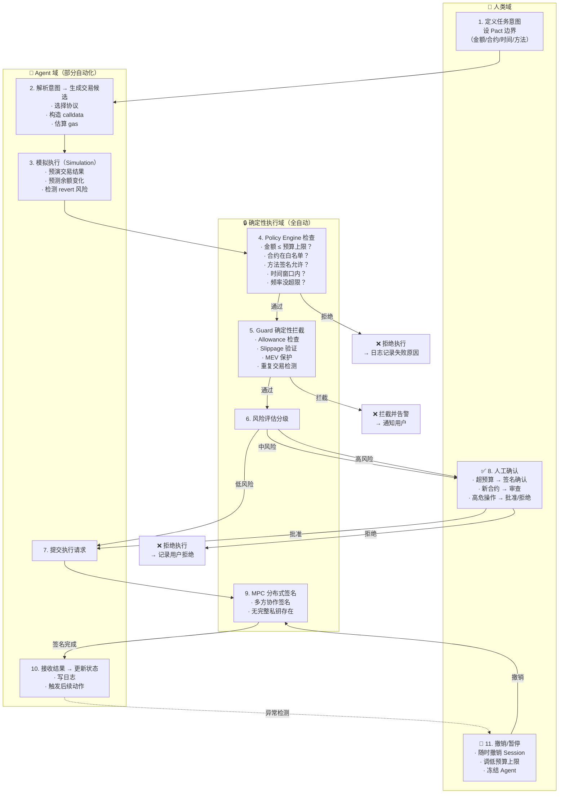

# Week 2 Module D — Wallet / Permission / Agent 链上动作权限策略

> 场景：Agent 在授权边界内自主执行链上操作时的权限分层与安全策略
> 作者：Calciux | 日期：2026-06-12
> 课程：AI × Web3 School Bootcamp Week 2 — Module D
> 关联：Hackathon Cobo 02 — Trustless Agent Work Agreements（ERC-8183）

---

## 目录

- [一、核心问题陈述](#一核心问题陈述)
- [二、Agent 链上动作执行流程图](#二agent-链上动作执行流程图)
- [三、权限策略设计](#三权限策略设计)
- [四、ERC-4337 / Safe / Guard & Policy 为什么重要](#四erc-4337--safe--guard--policy-为什么重要)
- [五、与 CAW Pact 的关系](#五与-caw-pact-的关系)
- [六、风险和限制](#六风险和限制)

---

## 一、核心问题陈述

当 Agent 参与链上动作时，最重要的问题不是"怎么调用签名 API"，而是**权限如何授予、限制、撤销、审计和恢复**。

| 不是什么 | 是什么 |
|---------|--------|
| 给 Agent 一个私钥让它自由签名 | 给 Agent 一个可验证、可限制、可撤销的行动空间（Session Key / Pact） |
| 一次性授权永久有效 | 预算、范围、时间、操作类型的组合条件授权 |
| Agent 输出即执行 | Agent 输出 → Policy 拦截 → Guard 检查 → 确认 → 执行 |
| 出了事只能事后追责 | 执行前模拟 + 确定性拦截 + 链上审计日志 + 随时撤销 |

**核心原则**：Agent 是 untrusted 的概率组件，权限系统用确定性规则在 Agent 行动前后做独立检查。

---

## 二、Agent 链上动作执行流程图



### 节点明细

| 节点 | 名称 | 执行者 | 关键动作 | 自动化等级 |
|:----:|------|:-----:|---------|:---------:|
| 1 | 定义任务意图 | **用户** | 设 Pact 参数（合约白名单、预算、时间窗口） | **❌ 人工** |
| 2 | 解析意图 → 构造候选交易 | Agent | 自然语言 → 交易参数（to/data/value） | ✅ 自动 |
| 3 | 模拟执行 | Simulator | 预演交易结果，检查 revert/gas | ✅ 自动 |
| 4 | Policy Engine | **确定性系统** | 金额、合约、方法、频率、时间 5 维检查 | ✅ 自动 |
| 5 | Guard | **确定性系统** | Allowance、Slippage、重复交易、MEV | ✅ 自动 |
| 6 | 风险评估 | Policy Engine | 根据金额/操作类型/New vs Known 分三级 | ✅ 自动 |
| 7 | 提交执行请求 | Agent | 构造签名请求 → 发至执行层 | ✅ 自动 |
| 8 | 人工确认 | **用户** | 查看模拟结果 → 批准/拒绝 | **❌ 人工** |
| 9 | MPC 签名 | **多方签名服务** | 分布式签名，无完整私钥 | ✅ 自动 |
| 10 | 接收结果 + 更新状态 | Agent | 写日志、通知用户、触发下一动作 | ✅ 自动 |
| 11 | 撤销/暂停 | **用户** | 撤销 Session Key / 修改 Policy | **❌ 人工** |

### 自动化边界总结

```
低风险（自动执行）         中风险（模拟 + 确认）          高风险（强制人工）
┌──────────────────┐    ┌────────────────────┐    ┌───────────────────────┐
│ · 白名单合约内      │    │ · 超过日限额 50%     │    │ · 超过单笔最大限制      │
│ · 固定金额转账      │    │ · 新合约首次交互      │    │ · 合约部署/升级        │
│ · 白名单方法调用     │    │ · 跨协议组合操作      │    │ · 治理投票            │
│ · 已知 token swap   │    │ · 非标准 token 交互   │    │ · 私钥/所有权转移      │
│ · 允许范围内再平衡    │    │ · 大额 approve      │    │ · 白名单外合约         │
│ · 链上数据查询       │    │                    │    │ · 超过预设损失阈值      │
└──────────────────┘    └────────────────────┘    └───────────────────────┘
    无需人工                   人工快速审                   强制拒绝或人工签名
```

---

## 三、权限策略设计

以下为一个 Agent Wallet 场景的完整权限策略方案，围绕 **Pact（任务级授权）** 模型设计。

### 3.1 策略总览

| 维度 | 策略 | 说明 |
|------|------|------|
| **授权模型** | Pact（任务级一次性授权） | 不是给 Agent 长期权限，而是围绕一次具体任务生成临时授权 |
| **授权对象** | Agent ID（绑定 Session Key + 钱包地址） | Agent 被允许代表谁执行 |
| **授权周期** | 任务生命周期 | 任务完成后权限自动失效 |

### 3.2 预算策略

| 参数 | 默认值 | 说明 |
|------|:-----:|------|
| 单笔最大金额 | 0.1 ETH | 单次交易上限 |
| 每日累计上限 | 0.5 ETH | 24 小时内所有交易总和 |
| 每周累计上限 | 2 ETH | 7 天内所有交易总和 |
| 最大损失上限 | 0.05 ETH | 单个策略的允许亏损（含 slippage + gas） |
| Gas 单价上限 | 50 gwei | 防止 Agent 在 gas 高峰时浪费 |
| 滑点上限 | 1% | 仅适用于 swap 操作 |

**预算优先级**：单笔 ≤ 每日 ≤ 每周。Agent 请求超出任意层即被拒绝。

**超出处理**：自动拒绝，记录到 Audit Trail，通知用户。用户可手动调高限额（需要签署新的 Pact）。

### 3.3 可调用合约 / 可执行动作

合约白名单 + 方法签名白名单：

| 合约（Symbol） | 地址 | 允许的方法 | 限制 |
|---------------|:----:|-----------|------|
| Uniswap V3 Router | 0xE592... | `exactInputSingle`, `exactInput` | 仅 ETH→ERC-20 和 ERC-20→ETH |
| Aave V3 Pool | 0x8787... | `deposit`, `withdraw` | 仅 USDC/ETH/wstETH 池 |
| Compound III | 0xc3d6... | `supply`, `withdraw` | 仅 USDC 池 |
| ERC-20 基础 | 0x... | `approve`, `transfer` | approve 仅限白名单协议地址；金额 ≤ 1.5x 当日预算 |

**禁止动作**（Policy Engine 直接拦截）：

| 操作类型 | 风险 | 策略 |
|---------|:----:|------|
| 合约部署 | 🔴 无限责任 | 永远拒绝 |
| 合约升级（delegatecall） | 🔴 控制权转移 | 永远拒绝 |
| 转让所有权（Ownership） | 🔴 资产丢失 | 永远拒绝 |
| 治理投票委托 | 🟡 治理权移交 | 强制人工 |
| 签名消息（EIP-712） | 🟡 钓鱼风险 | 强制人工 |
| Permit/ERC-2612 签名 | 🟡 代币授权三明治 | 强制人工 |

### 3.4 人工确认阈值

| 条件 | 风险等级 | 行动 |
|------|:-------:|------|
| 单笔 ≤ 0.01 ETH + 白名单合约 + 已知方法 | 🟢 **自动** | 无人工介入 |
| 单笔 0.01–0.1 ETH + 白名单合约 | 🟡 **模拟确认** | 展示模拟结果，用户一键确认 |
| 单笔 > 0.1 ETH | 🔴 **强制签名** | 用户必须在钱包中签名交易 |
| 新合约（不在白名单） | 🔴 **强制人工** | Agent 请求被挂起，等待审批加入白名单 |
| 新方法（不允许） | 🔴 **直接拒绝** | 不请求人工，直接返回拒绝 |
| 单日累计超 50% 限额 | 🟡 **告警提醒** | 通知用户 + 继续执行（用户可随时撤销） |
| 异常活动检测 | 🔴 **冻结** | 自动暂停全部 Agent 权限，通知用户 |

### 3.5 撤销方式

| 撤销方式 | 时效 | 说明 |
|---------|:----:|------|
| **Session Key 过期** | 任务完成 / 时间到期 | 自动失效，最安全 |
| **用户手动撤销** | 即时 | 用户调用 `revokeSession(sessionId)` |
| **链上撤销（Pact 撤销）** | 下一笔交易开始 | 用户发送 `revokePact(pactId)` 交易 |
| **自动撤销（异常检测）** | 即时 | 检测到多次 Policy 违规 / 异常 gas 消耗 |
| **预算耗尽** | 自动 | 日/周上限达到后再请求自动拒绝 |
| **紧急暂停（Kill Switch）** | 即时 | 用户调用 `emergencyPause()` 暂停全部 Agent |

### 3.6 日志与审计记录

每条 Agent 链上动作请求必须记录以下 Audit Trail：

| 字段 | 类型 | 说明 |
|------|------|------|
| `requestId` | bytes32 | 唯一请求标识 |
| `agentId` | address | 发起请求的 Agent |
| `pactId` | bytes32 | 关联的 Pact ID |
| `txData` | bytes | 构造的完整交易数据 |
| `simulationResult` | json | 模拟执行结果（余额变化、revert 风险） |
| `policyResult` | json | Policy Engine 逐项检查结果 |
| `riskLevel` | uint8 | 0=auto / 1=confirm / 2=reject |
| `humanDecision` | bool/null | 人工决定（null = 未需要人工） |
| `executionHash` | bytes32/null | 链上 tx hash（null = 未执行） |
| `failureReason` | string | 失败原因（Policy 拒绝 / 人工拒绝 / tx revert） |

**存储架构**：

```
┌──────────────────────┐
│  链上（Events）        │  ← 不可篡改的永久记录
│  · PactCreated        │     txHash + event log
│  · ExecutionRequested │     任何人可验证
│  · ExecutionCompleted │
│  · SessionRevoked     │
├──────────────────────┤
│  链下（数据库）         │  ← 完整的上下文记录
│  · simulationResult   │     含模拟中间状态
│  · policyChecks       │     Policy 判定详细原因
│  · agent internal     │     便于事后审计复盘
│    reasoning          │
└──────────────────────┘
```

**审计访问**：用户在任何时间可以查询 `pactId` 获得完整执行历史。

### 3.7 失败处理

| 失败类型 | 处理策略 | 通知用户 |
|---------|---------|:-------:|
| **Policy Engine 拒绝** | 记录失败原因，不消耗 gas | ✅ 日志记录 |
| **交易 Revert** | 记录 revert 原因（已消耗 gas） | ✅ 立即通知 |
| **Slippage 超标** | 自动取消交易，标记为需调整策略 | ✅ 立即通知 |
| **Gas 估算失败** | 重试 1 次，更换 gas price | ⚠️ 失败通知 |
| **RPC 错误** | 重试 3 次，更换 RPC 端点 | ⚠️ 失败通知 |
| **Session Key 过期** | 自动拒绝，请求用户重新授权 | ✅ 重要通知 |
| **人工驳回** | 记录驳回原因，不消耗 gas | — |
| **Guard 拦截** | 记录拦截原因，可选静默告警 | ✅ 中高风险通知 |
| **MPC 签名失败** | 重试 2 次，通知用户基础设施故障 | ✅ 紧急通知 |

**重启机制**：失败超过 3 次 → 自动暂停 Agent 执行 → 等待用户检查并手动恢复。

---

## 四、ERC-4337 / Safe / Guard & Policy 为什么重要

### 4.1 ERC-4337 — 账户抽象（Account Abstraction）

**是什么**：不修改以太坊共识层的前提下，通过 UserOperation（UserOp）内存池将标准 EOA 账户升级为智能合约账户的标准协议。

| 能力 | 解决的风险 | 对 Agent 的意义 |
|------|-----------|:---------------:|
| **分离所有权与执行** | 私钥丢失 = 资产全丢 → 多签/社交恢复 | Agent 可以触发执行但不持有私钥 |
| **批量操作（Bundle）** | 多笔交易独立签名 → 高 gas + 复杂协调 | Agent 构造多步操作 → 打包为一笔 UserOp 提交 |
| **Paymaster** | Agent 没有原生 ETH 付 gas → 卡住 | 用户/赞助方代付 gas，Agent 只需关注业务逻辑 |
| **非托管** | 交易所托管 → 单点故障 | 用户始终控制账户所有权，Agent 只拿到执行权 |

**ERC-4337 解决的 Agent 特有风险**：

```
没有 4337 时：
  Agent 拿 EOA 私钥 → 私钥泄露 → 无限损失 → 不信任
  Agent 作为独立 EOA → 需要持有 ETH 付 gas → 增加攻击面

有 4337 时：
  Agent 提交 UserOp → 用户 Paymaster 代付 gas
  Agent 能提议执行 → 但无权转移账户所有权
  UserOp 可被 Policy/Guard 检查后再提交
```

### 4.2 Safe — 多签 + 智能账户（前身 Gnosis Safe）

**是什么**：最多签名的智能合约账户，N/M 签名阈值。目前最广泛使用的智能账户标准。

| 能力 | 解决的风险 | 对 Agent 的意义 |
|------|-----------|:---------------:|
| **多签确认** | 单点签名 → 单点故障 | Agent 占 1 票，用户自己占剩余 N-1 票，Agent 不能单签通过 |
| **Guard 模块** | 无前置检查 → 不可逆错误 | 在交易执行前运行 Guard 逻辑，拒绝不合规调用 |
| **Module 模块** | 不可扩展 → 功能限制 | Agent 作为 Module 注册，获得受限的执行能力 |
| **撤销 Module** | 授权不可追溯 → 授权后无法收回 | 随时 `disableModule()` 移除 Agent 执行权 |

**Safe + Agent 的典型架构**：

```
用户（签名者 1）────┐
                    ├── Safe（2/3 多签）───→ 交易
用户手机（签名者 2）──┤                                      ↑
                    │                              Module 桥
Agent（签名者 3）───┘                         ┌──────────────┐
                                              │  Agent Module │
Agent 只能通过 Module 执行受限操作              │  (Guard+Policy)│
用户签名者可以绕过 Module 执行任意操作           └──────────────┘
```

**Safe 解决的 Agent 特有风险**：

```
Agent 最多能「提议」执行，不能「独断」执行（除非多签阈值设为 1）
Guard 在交易前能拒绝不合规调用——Agent 无法通过 Safe 卖出不在白名单的 token
Module 注册/移除链上可查——Agent 权限可被「可验证地」移除
```

### 4.3 Guard / Policy — 确定性拦截层

**是什么**：在交易执行前运行的确定性检查逻辑。Guard（Safe 概念）检查单笔交易合法性，Policy Engine（Cobo 等产品）做策略级评估。

| 机制 | 检查时机 | 检查什么 | 确定性 |
|:----:|:--------:|---------|:------:|
| **Policy Engine** | Agent 提交请求后，签名前 | 金额、合约、方法、频率、时间窗口 | ✅ 确定性 |
| **Guard** | 交易进入 Safe 执行前 | calldata 白名单、allowance、调用方 | ✅ 确定性 |
| **Simulation** | Policy 检查后 | 交易结果预演、余额变化、revert 风险 | ✅ 确定性 |
| **MEV Guard** | 交易发送前 | 三明治攻击检测、slippage 保护 | ✅ 确定性 |

**Guard / Policy 解决的风险**：

```
┌─────────────────────────────────────────────────────────────┐
│  Guard/Policy 拦截的例子（全部确定性，不依赖 AI 正确性）：    │
├─────────────────────────────────────────────────────────────┤
│  · Agent 被 Prompt Injection 诱导调用 transferOwnership     │
│    → Guard: 方法签名不在白名单 → 拦截 ✅                    │
│  · Agent 被恶意文档误导 approve 全部余额                    │
│    → Policy: approve 金额 > 当日预算 → 拦截 ✅              │
│  · Agent 试图在非白名单 DEX 上 swap                        │
│    → Policy: 合约地址不在白名单 → 拦截 ✅                   │
│  · Agent 在 uniswap 上设置 99% slippage                    │
│    → Guard: slippage > 预设阈值 → 拦截 ✅                  │
│  · Agent 每小时发起 100 次 swap                            │
│    → Policy: 频率超限 → 拦截 ✅                            │
└─────────────────────────────────────────────────────────────┘
```

### 4.4 三者组合：Agent 安全栈

```
Agent 不安全的主要风险
━━━━━━━━━━━━━━━━━━━
┌─ AI 幻觉 ────┐  ┌─ Prompt Injection ─┐  ┌─ 私钥泄露 ──┐
│ 构造错误交易    │  │ 被诱导执行恶意操作   │  │ 无限资产损失   │
└───────────────┘  └────────────────────┘  └─────────────┘
        │                     │                     │
        ▼                     ▼                     ▼
安全栈各层拦截
━━━━━━━━━━━━━
┌─ Layer 0: Agent 沙箱 ────────────────────────────────┐
│  · 限制 Agent 能访问的上下文（不能读取私钥/API Key）    │
│  · Agent 输出格式化为结构化交易请求，不生成签名          │
└───────────────────────────────────────────────────────┘
        │                     │                     │
        ▼                     ▼                     ▼
┌─ Layer 1: Simulation ─────────────────────────────────┐
│  · 预演交易：余额变化？revert？allowance 变动？        │
│  · 把预测结果喂给下一层做判断                           │
└───────────────────────────────────────────────────────┘
        │                     │                     │
        ▼                     ▼                     ▼
┌─ Layer 2: Policy Engine ──────────────────────────────┐
│  · 确定性规则检查：金额？合约？方法？频率？时间？        │
│  · 符合则通过，不符合则拒绝（无人可 override）          │
└───────────────────────────────────────────────────────┘
        │                     │                     │
        ▼                     ▼                     ▼
┌─ Layer 3: Guard ──────────────────────────────────────┐
│  · Safe 执行前的最后一道确定性拦截                      │
│  · 检查 calldata + allowance + slippage                │
└───────────────────────────────────────────────────────┘
        │                     │                     │
        ▼                     ▼                     ▼
┌─ Layer 4: 多签 / MPC ────────────────────────────────┐
│  · Safe: Agent 只有 N 票中的 1 票                       │
│  · MPC: 私钥不存在于完整形态                            │
│  · 无论前几层如何，签名层限制执行权                      │
└───────────────────────────────────────────────────────┘
        │                     │                     │
        ▼                     ▼                     ▼
┌─ Layer 5: 事后审计 ───────────────────────────────────┐
│  · 链上事件记录：每次请求 + 每次执行/拒绝                │
│  · 用户可追溯查询：谁、什么时候、做了什么、结果如何        │
│  · 异常行为可触发自动暂停                               │
└───────────────────────────────────────────────────────┘
```

### 4.5 三者各自的不可替代性

| 标准/机制 | 不可替代解决什么 | 没有它会发生什么 |
|----------|----------------|-----------------|
| **ERC-4337** | 让 Agent 不需要 EOA 私钥也能发起交易——用 UserOp 表达执行意图 | Agent 必须持有私钥 → 私钥泄露 = 无限损失；或每次交易需要用户在线签名 → 无法自主执行 |
| **Safe** | 多签约束 + Module 插件架构——Agent 作为 Module 获得受限执行权，用户随时移除 Module | Agent 拥有执行权后无法可验证地撤销；Agent 被攻破后能独断执行任意操作 |
| **Guard/Policy** | 交易执行前的**确定性**拦截——不依赖 AI 正确性或用户警觉性 | AI 被注入后执行任意恶意操作；用户错过告警或被社会工程欺骗；Policy 只写不执行就是空话 |

---

## 五、与 CAW Pact 的关系

Cobo Agentic Wallet 的 **Pact** 是上述权限策略的一个生产级实现，不是另一种方案。

| 本文概念 | CAW Pact 等价物 |
|---------|:--------------:|
| 任务级授权 | **Pact** — 用户确认 Agent 的任务意图、预算、操作范围、时间窗口 |
| Policy Engine | **Policy Engine** — 确定性规则引擎，拦截越界请求 |
| Guard | **CAW Guard** — 交易执行前检查 |
| Session Key | **Session Key / EOA Key** — 临时受限密钥 |
| MPC 签名 | **Cobo MPC** — Cobo 基础设施提供 |
| 撤销 Session | **Revoke Pact** — 用户可随时撤销 |

**Pact 与本文方案的共同设计理念**：

1. **Agent 不持有无限权限**——权限绑定具体任务，任务结束权限消失
2. **确定性边界 > AI 判断**——Policy 用确定性规则拦截，不依赖 AI 诚实
3. **人工确认不可绕过**——高风险操作必须人工签名
4. **可审计是必选项**——所有请求和执行记录链上可查

---

## 六、风险和限制

| 风险 | 级别 | 说明 |
|------|:---:|------|
| **Policy 太松 = 没设，太紧 = 不能用** | 🔴 高 | 工程折中——日限额设 0.1 ETH 则 Agent 无法执行复杂策略，设 10 ETH 则风险敞口大。用户需要根据自身场景动态调整阈值。没有通用的完美参数 |
| **用户在「确认」时看不懂在确认什么** | 🔴 高 | 模拟结果展示交易后资产变化，但大多数用户看不懂 Permits、Allowance 变化、approval 陷阱。Human Check 界面设计是关键瓶颈——不是"给它看哈希"，而是"让用户看清资产变化" |
| **Session Key 泄露** | 🟡 中 | Session Key 是临时密钥，泄露后攻击者可在其有效期内执行受限操作。缓解：绑定 IP/域名、短有效期、行为异常自动撤销 |
| **多层系统复杂度** | 🟡 中 | ERC-4337 + Safe + Guard + Policy + MPC 五层堆叠带来运维复杂度和潜在实现漏洞。每层都是可攻击面。MVP 阶段可以先从 Policy Engine + Simulation 两层开始 |
| **用户心理门槛** | 🟡 中 | "让 AI 管钱"这件事本身就有极高的信任门槛。即使技术完全正确，用户不敢用就是失败。需要渐进信任——从只读 → 白名单小额 → 白名单大额 → 策略执行 |
| **L1 gas 成本** | 🟢 低 | UserOp + Safe + Guard 每笔交易多出额外 gas 开销。小额高频操作在 L1 上不经济。推荐 L2 或特定链部署 |

---

## 七、总结

**一句话回答 Module D 的核心问题**：

> Agent 接触钱包和链上动作时，不是"能不能签名"，而是"在什么范围、什么条件、什么限制下可以执行——以及如何立刻停下来"。

**三件必须做的事**：

1. **确定性拦截层（Policy + Guard）** — 用规则而非 AI 判断做安全防线
2. **任务级授权（Pact / Session Key）** — 不给无限权限，给任务绑定的临时边界
3. **可审计 + 可撤销（Audit Trail + Revoke）** — 所有动作可追溯，权限可随时收回

**三个常见反例判断**：

| 反例 | 为什么不行 |
|------|-----------|
| "给 Agent 一个钱包私钥，它能自动交易" | 私钥泄露 = 无限损失；无法撤销（除非转走全部资产） |
| "Agent 有全权管理用户 Safe" | 多签设 1/1 = 没有多签；Agent 被攻破后可以 drain 整个 Safe |
| "Agent 有无限 approve" | 一个恶意合约就能拿走所有代币——没有额度限制了 |

**好的 Agent 权限策略不依赖 Agent 诚实**——它假设 Agent 随时可能被攻破、被注入、或产生幻觉，然后用确定性系统和人工确认在 Agent 行动前后做独立检查。
