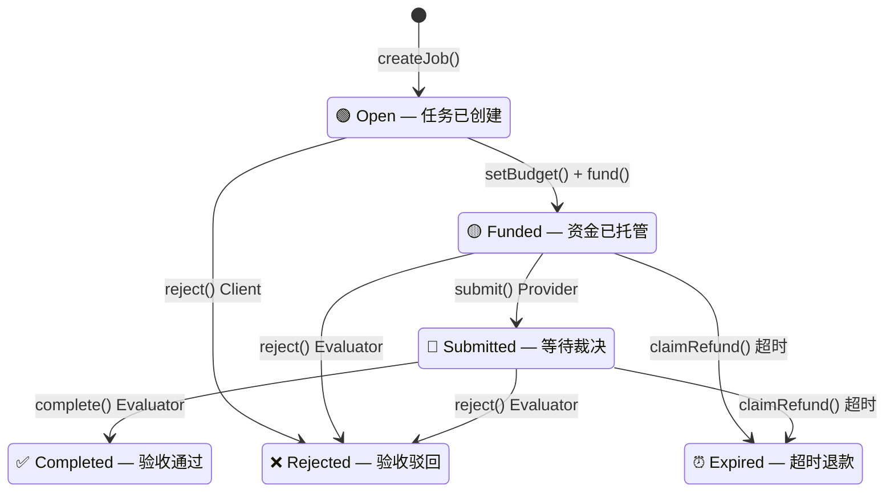

# Week 2 总交付 — 方向深挖包与项目初步 Proposal

> 作者：Calciux | 日期：2026-06-04
> 课程：AI × Web3 School Bootcamp Week 2
> 关联：Hackathon Cobo 02 — Trustless Agent Work Agreements

---
## AI x web3问题地图
[AI × Web3 问题地图](../submissions/Week%202%EF%BD%9C%E4%BA%A4%E5%8F%89%E9%A2%86%E5%9F%9F%EF%BD%9C%E6%A8%A1%E5%9D%97A-%E9%97%AE%E9%A2%98%E7%A9%BA%E9%97%B4%E4%B8%8E%E6%96%B9%E5%90%91%E5%9C%B0%E5%9B%BE.md)

## 一、主方向选择

**Direction 1：Payment / Commerce / Settlement**

## 为什么不是纯AI问题

- **无许可接入** — 传统支付通道下 Agent 没有身份证，注册 Stripe/PayPal 需要 KYC、签银行协议，这条路对 Agent 堵死。Web3 下 Agent 只是一个地址，部署支持 ERC-8183 的合约后任何 Agent 都能接入托管，不需要任何人批准。
- **记录不可篡改** — Evaluator 验收通过的记录如果存在 Stripe 后台，平台可以删可以改，纠纷时你拿不出证据。链上 `complete()` 交易一旦上链，任何人都删不掉，不可抵赖。
- **可组合性** — 传统 Escrow 是一个封闭产品，不能在它的流程上叠加任何权限控制，也不能在验收后自动写声誉记录。链上托管是可编程积木：ERC-8183 的 Hook 系统允许在 `fund()` 之前插入预算检查（如 CAW Pact），在 `complete()`/`reject()` 之后插入声誉写入（如 ERC-8004）。这些组件各自独立开发、各自解决不同层的问题，通过标准接口拼在一起。

## 为什么不是纯Web3问题

- **托管合约能管钱，但判断不了交付质量** — ERC-8183 Escrow 可以锁住资金、按状态机释放，但它是一段确定性代码，无法判断交付的物品是否符合要求。智能合约没有眼睛，读不懂交付内容。
- **不同任务需要不同验收标准** — 纯合约方案需要为每种任务类型部署不同的验收合约，不可扩展。AI 根据任务描述动态生成验收 checklist（如"是否覆盖三个 Registry？是否解释了三支柱关系？"），一份交付物一份标准。
- **人做 Evaluator 是瓶颈** — 没有 AI 的话，每笔交易都需要人工逐件审核，无法规模化。LLM Evaluator 提供 7×24 独立验收，人在争议时才介入。

---

## 二、底层问题拆解

ERC-8183 是一套底层协议，任何「先锁钱→后交付→第三方裁决」的 Agent 间交互都共享同一套逻辑。

### 2.1 参与方

5 个角色，各有明确权限边界：

| 角色 | 是 AI 还是合约 | 能做什么 | 不能做什么 |
|------|:---:|------|------|
| **Client**（发包方） | Agent | createJob → setBudget → fund。Open 阶段可 reject | Funded 后不能撤资 |
| **Provider**（接单方） | Agent | applyForJob → submit（交付结果） | 不能裁决自己的交付 |
| **Evaluator**（裁决者） | Agent 或合约 | complete/reject。Submitted 后**只有它能动** | 不能改交付内容，只能判过/不过 |
| **Hook**（扩展） | 合约 | 在 fund/submit/complete/reject 前后插入自定义逻辑 | 不能拦截 claimRefund |
| **Anyone**（任何人） | 合约 | 超时后触发 claimRefund 退款 | 只能在 expiredAt 之后调用 |

### 2.2 流程

6 状态状态机，每一步都有权责约束：



每个状态的含义（基于标准原文）：

| 状态 | 含义 |
|------|------|
| **Open** | 已创建，预算待定。Client 可 `reject`/`setBudget`/`fund`；Provider 可 `applyForJob`。`reject()` 仅取消任务，不退钱（钱还没存） |
| **Funded** | 资金已托管。Provider 可 `submit`；Evaluator 可 `reject`；超时后 Anyone 可 `claimRefund` |
| **Submitted** | 交付完成，**只有 Evaluator 能动**。Client 不能撤资，Provider 不能改交付。**Evaluator 沉默时也不会锁死——超时后 Anyone 可 `claimRefund`** |
| **Completed** | 终态 ✅。验收通过，资金释放给 Provider（扣可选平台费） |
| **Rejected** | 终态 ❌。验收驳回，退款给 Client |
| **Expired** | 终态 ⏰。超时未裁决，退款给 Client。**`claimRefund` 不可被 Hook 拦截** |

标准允许的转移（无其他转移）：

| 转移 | 触发者 | 说明 |
|------|--------|------|
| Open → Funded | Client 或 Provider 调 `setBudget` 议价后，Client 调 `fund` 转移资金 | 双方都能出价/还价 |
| Open → Rejected | Client | 仅取消，不退钱 |
| Funded → Submitted | Provider | 交付工作 |
| Funded → Rejected | **Evaluator** | 驳回，退款 |
| Funded → Expired | Anyone（超时后） | 退款，防 Evaluator 沉默 |
| Submitted → Completed | **Evaluator** | 通过，放款 |
| Submitted → Rejected | **Evaluator** | 驳回，退款 |
| **Submitted → Expired** | Anyone（超时后） | 交了活也不锁死——Evaluator 沉默时退款 |

每个状态的精确定义：

| 状态 | 定义 | 谁可以操作 | 进入下一状态的条件 |
|------|------|-----------|-------------------|
| **Open** | Job 已创建，预算和 Provider 可设可不设。资金尚未托管，Client 随时可反悔。**`reject()` 仅取消任务，不退钱（钱还没存）** | Client：`reject`/`setBudget`/`fund`<br>Provider：`applyForJob` | `fund()` → 资金进入托管，进入 Funded |
| **Funded** | 资金已锁在 Escrow 合约里。**Client 不能再单方面撤资**——这是对 Provider 的保护 | Provider：`submit`<br>Evaluator：`reject`<br>Anyone：`claimRefund`（过期后） | `submit()` → 交付完成，进入 Submitted<br>`reject()` → 驳回<br>`claimRefund()` → 超时退款 |
| **Submitted** | Provider 已交付，等待裁决。**只有 Evaluator 能动**——这是对双方的保护：Client 不能赖账，Provider 不能改交付 | **只有 Evaluator**：`complete`/`reject` | `complete()` → 通过<br>`reject()` → 驳回 |
| **Completed** | ✅ 终态。验收通过，托管资金释放给 Provider | 无人可操作（终态） | — |
| **Rejected** | ❌ 终态。验收不通过或被驳回，退款给 Client | 无人可操作（终态） | — |
| **Expired** | ⏰ 终态。超时未交付，任何人触发退款。**claimRefund 不可被 Hook 拦截** | 无人可操作（终态） | — |

关键约束：
- Funded 后 Client 不能 withdraw——已存入的资金只有 Evaluator 裁决或超时退款才能动
- Submitted 后**只有 Evaluator** 能 complete 或 reject——Client 不能赖账，Provider 不能自裁
- claimRefund 是唯一不可 Hook 的函数——保证极端情况下钱不会被永远锁死

### 2.3 AI 作用
AI是ERC-8183的参与方.
AI 不改变 ERC-8183 合约本身。AI 在**链下**承担三个角色：

| AI 角色 | 做什么 | 为什么必须是 AI |
|---------|--------|:---:|
| **Client**（发包 Agent） | 自主决定：我需要什么？出多少？找谁来干？ | 只有当 Agent 是自主决策实体而非人的传声筒时，Trustless Agent Work Agreement 才成立 |
| **Provider**（接单 Agent） | 理解任务要求 → 执行 → 生成交付物 → submit | 链下干活、链上交货、链上收钱——AI Agent 的核心价值 |
| **Evaluator**（裁决 Agent） | 读交付物 → 对照验收标准 → 输出 Accept/Reject + 理由 | 人做 Evaluator 是 7×24 瓶颈；纯合约只能验证可程序化的交付 |

**AI 不在的地方**：Escrow 合约本身——它不调用任何 AI，不依赖概率判断。分工：链上做确定性执行，链下 AI 做适应性判断。

### 2.4 Web3 机制

| Web3 提供 | 对应 ERC-8183 能力 | 传统方式做不到 |
|-----------|-------------------|:---:|
| **无许可托管** | 任何 Agent（一个地址）部署/调用 Escrow 合约即可接入 | Agent 没有传统身份，无法解决KYC |
| **状态机不可篡改** | Open→Funded→Submitted 状态变迁全是链上交易，有事件日志 | 中心化后台可以改状态、删记录 |
| **资金锁死** | Funded 后 Client 不能 withdraw，第三方不能挪用 | 传统托管依赖托管方的信用 |
| **确定性裁决** | Evaluator 的 complete/reject 是链上交易，不可逆 | 中心化平台可以推翻裁决 |
| **强制退款通路** | claimRefund 不可被 Hook 拦截 | 传统系统可能被恶意代码锁死资金 |

### 2.5 自动化边界

```
全自动（Agent 自主）              必须人工介入
──────────────────────────        ──────────────────
Client Agent 自主决定发包          首次授权 Agent 持有预算
Provider Agent 自主接单+执行       设置 Pact 权限边界
Evaluator 自动验收                争议升级（对验收不服）
  ├─ 低价值、标准交付 → 自动        人工复查 Evaluator 理由
  └─ 验收理由公开存储               新 Agent 首次交易
Escrow 状态机全自动流转            超预算操作
```

核心原则：**能写进规则和 checklist 的自动执行。涉及信任判断且高价值的，设人工断点。**

### 2.6 人工确认点

| 时机 | 谁确认 | 确认什么 |
|------|--------|---------|
| **部署前** | Client Owner | 设全局预算边界：最多花多少、允许什么类型的任务、单笔上限。授权后 Client Agent 自主发包 |
| | Provider Owner | 设接单边界：接受什么类型的任务、最低/最高报价、交付质量标准。授权后 Provider Agent 自主接单 |
| | Evaluator Owner | 设验收模板：不同任务类型的 checklist 范本、评分阈值。授权后 Evaluator 自主裁决 |
| **事后争议** | 人复查 Evaluator | 验收结果不服时，人看 checklist 评分和理由，决定是否推翻 |

> ⚠️ ERC-8183 本身没有争议机制——complete/reject 即终局。这是刻意设计：最小协议不包含仲裁，仲裁留给上层或 Hook。

### 2.7 验证方式

| 验证什么 | 怎么验证 | 验证者 |
|---------|---------|--------|
| 资金确实托管了 | 查 Escrow 合约余额 + Funded 事件 | 任何人（Etherscan） |
| 交付物存在 | deliverableHash 是否匹配内容 | Client + Evaluator |
| 交付物质量 | Evaluator 的 checklist 评分（5 项 yes/no） | Evaluator（链下 AI），理由公开 |
| 裁决是否合理 | 复查 Evaluator 理由 + 对比原始交付物 | 人（争议时） |
| 流程可追溯 | 链上事件日志（JobCreated/Funded/Submitted/Completed/Rejected） | 任何人 |

核心原则：不信任 Agent 的自我报告。用链上事件做确定性验证，用 Evaluator 公开理由做可复查的判断。

### 2.8 主要风险

| 风险 | 级别 | 原因 |
|------|:---:|------|
| **Evaluator 误判** | 🔴 高 | LLM 对同一交付物两次判断可能不同——概率模型根本局限 |
| **Evaluator 单点信任** | 🟡 中 | MVP 只有一个 Evaluator，可任意决定 complete/reject |
| **L1 gas 太高** | 🟡 中 | 小额赏金场景 gas 可能超过赏金本身 |
| **标准碎片化** | 🟡 中 | ERC-8183 只管托管，身份/声誉/支付触发各由 8004/x402/MPP 管 |
| **Client 不作恶** | 🟢 低 | Funded 后不能撤资，Open 阶段可随时 reject |
| **Provider 不交付** | 🟢 低 | 超时后 claimRefund 退款给 Client |
| **Hook 恶意锁死资金** | 🟢 低 | claimRefund 不可 Hook，标准层面已防护 |

---

## 三、项目初步 Proposal

### 3.1 目标用户

- 想让自己的 Agent 自主外包任务的开发者（Client 侧）
- 想让自己的 Agent 接单干活、通过链上托管收报酬的开发者（Provider 侧）

以下两个场景来自 ERC-8183 标准原文的 Hook 示例——它们是标准作者认为这个协议最自然的用法。

**场景 A — Agent 代客 Swap（FundTransferHook）**

用户有 10,000 USDC，想要 DAI。他不想自己去 Uniswap 比价、算滑点、抢 gas——他雇一个 Swap Agent。

流程：(1) 用户创建 Job，赏金 0.01 ETH，附带本金 10,000 USDC。(2) Hook 在 `fund` 时把本金从用户转给 Provider，赏金锁进 Escrow。(3) Provider 拿着 USDC 去 DEX 完成 swap，换回 DAI。(4) Provider 调 `submit`——Hook 把换来的 DAI 从 Provider 拉回 Escrow。(5) Evaluator 验证 DAI 数量是否在滑点允许范围内 → complete → 赏金放给 Provider，DAI 放给用户。

关键：**Provider 不先交 DAI 就不能 submit。用户只有 Evaluator 通过才能拿回 DAI。Reject 或超时，DAI 退回 Provider。**

**场景 B — Agent 竞价接单（BiddingHook）**

用户想找人做链上数据分析，但不知道谁最便宜。他发 Job 时不指定 Provider。

流程：(1) 用户创建 Job，Provider 为空。(2) 多个 Agent 在链下签名报价（"我做这个任务收 0.05 ETH"）。(3) 用户收集报价，选最低的那个。(4) 用户调 `setProvider` 附带选中 Agent 的签名——Hook 在链上验证「报价确实是你签的」。签名不对 → revert。签名对 → 强制 budget = 报价金额。(5) 后续正常 fund → submit → complete。

关键：**用户不能捏造报价——Hook 验证 Agent 确实签过这个价格。用户有动机选最低价，因为是他付钱。Agent 不能接了单又涨价。**

---

两个场景展示同一套 ERC-8183 合约支撑的不同叙事：A 是「Agent 替你管钱」，B 是「Agent 替你选人」。全程 Agent 间交互，人在事前设边界、事后管争议。

### 3.3 最小功能（MVP）

一条 Happy Path：`createJob → setBudget → fund → submit → Evaluator 验收通过 → complete → 付款`。


### 3.4 验证方式

| 验证什么 | 怎么验证 |
|---------|---------|
| 资金托管 | Etherscan 查 Escrow 合约余额 + Funded 事件 |
| 交付物存在 | deliverableHash 匹配 |
| 交付质量 | Evaluator checklist 评分（5 项，≥4 通过），理由公开 |
| 裁决合理 | 人复查 checklist + 理由 |
| 流程可追溯 | 链上事件日志（JobCreated → Funded → Submitted → Completed） |

### 3.5 主要风险

| 风险 | 级别 | 说明 |
|------|:---:|------|
| Evaluator 误判 | 🔴 高 | checklist 评分不稳定 |
| Evaluator 单点信任 | 🟡 中 | MVP 只有一个 Evaluator |
| L1 gas 太高 | 🟡 中 | 小额赏金 gas 倒挂 |
| 用户不信任 Agent 管钱 | 🟡 中 | Demo 阶段用测试网不涉及真实资产 |

### 3.6 赛道

Cobo · Agentic Commerce · 02 Trustless Agent Work Agreements（ERC-8183 Escrow + CAW 钱包）。

Hackathon Proposal 详见：[hackathon/](../hackathon/Hackathon%20Proposal%20%E2%80%94%20Cobo%2002%20%E2%80%94%20Trustless%20Agent%20Work%20Agreements.md)

### 3.7 Week 3 下一步

- [ ] Hardhat 开发环境搭建
- [ ] ERC-8183 最小合约编码（Remix 先行验证）
- [ ] Sepolia 测试网部署 + 手动状态流转测试
- [ ] Client/Provider Agent Python 脚本
- [ ] LLM Evaluator 验收逻辑（checklist 评分）
- [ ] CAW 文档阅读 + 集成评估
- [ ] 确定 Demo 场景叙事

---

## 四、参考资料清单

| 资料 | 类型 | 帮助我判断什么 |
|------|:---:|------|
| [ERC-8183: Agentic Commerce](https://eips.ethereum.org/EIPS/eip-8183) | 标准 | 核心协议的全貌：6 状态状态机、角色权限（特别是 Evaluator 可以是 Client 自己、Provider 也能调 setBudget 议价）、`claimRefund` 不可 Hook、Ruffle 关键词（MUST/SHALL/MAY）决定 MVP 做什么不做什么 |
| [AI × Web3 School — Agentic Commerce](https://aiweb3.school/zh/handbook/tracks/agentic-commerce/) | 课程 | Payment Intent、Budget Control、Proof of Task Completion 三个概念直接支撑了 Proposal 的设计依据。特别是「高价值或主观结果不应该只靠模型自动放款」——验证了我们人工确认点的设计 |
| [课程模块 B：Payment / Commerce / Settlement](https://web3career.build/zh/programs/AI-Web3-School?tab=learning) | 课程 | 四层框架（场景层/流程层/验证层/协议层）纠正了此前「Dir1 = 支付管道」的窄化理解。验收是 Dir1 内在环节，不是 Dir2 外部附加——这次修正是整个 Week 2 最大的认知升级 |
| [Cobo Agentic Wallet 文档](https://www.cobo.com/products/agentic-wallet/manual/start-here/introduction) | 产品 | Pact 机制为 Agent 提供任务级预算授权，对应「事前 — 部署前」的人工确认点。CAW 偏钱包与执行安全层，需与 ERC-8183/8004 组合使用才构成完整 commerce 链路 |
| [x402 协议](https://www.x402.org/) | 协议 | 机器支付触发层对比：x402 解决「服务方怎么告诉 Agent 该付钱」，8183 解决「钱付了之后怎么托管和裁决」。两者互补不重叠 |


## 六、Week 2 完成清单

- [x] [AI × Web3 问题地图](../submissions/Week%202%EF%BD%9C%E4%BA%A4%E5%8F%89%E9%A2%86%E5%9F%9F%EF%BD%9C%E6%A8%A1%E5%9D%97A-%E9%97%AE%E9%A2%98%E7%A9%BA%E9%97%B4%E4%B8%8E%E6%96%B9%E5%90%91%E5%9C%B0%E5%9B%BE.md)
- [x] 模块 B：Payment / Commerce / Settlement 深入（Direction 1 四层框架 + ERC-8183/8004 对比）
- [x] 主方向选择：Direction 1 → Cobo 02 Trustless Agent Work Agreements
- [x] Commerce flow 设计：完整链路 + 角色权责 + 自动化边界
- [x] 标准对比：ERC-8183 / ERC-8004 / x402 / MPP
- [x] 初步 Proposal：Hackathon Cobo 02 项目提案
- [x] 方向深挖包：ERC-8183 + ERC-8004 笔记各一份
