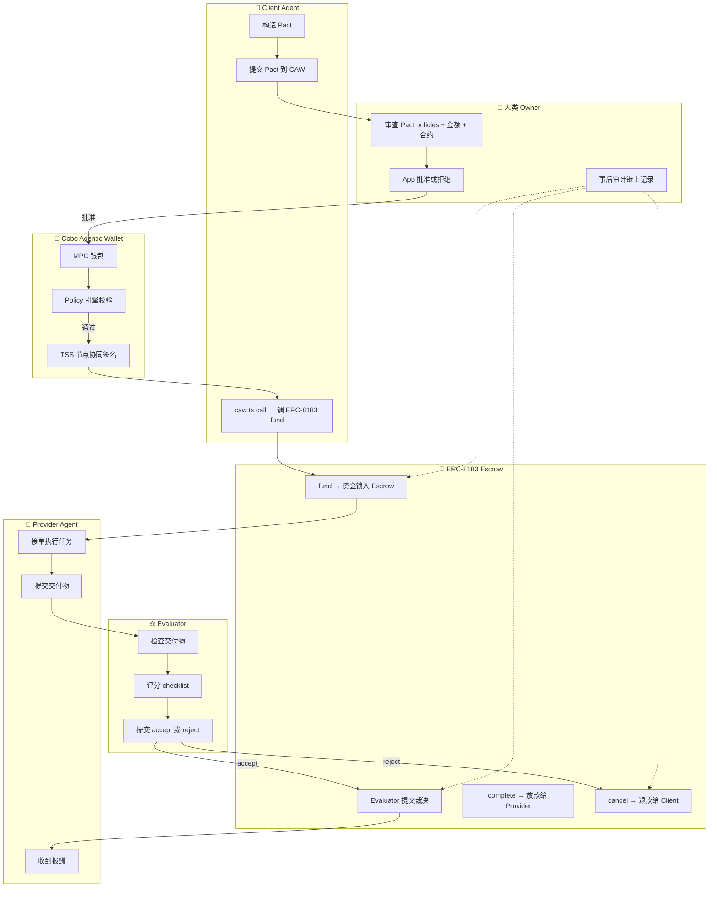

# 项目流程图 — ERC-8183 × CAW 全链路

## 关键边界标注

| 步骤 | 谁控制 | 谁能干预 | 不可逆点 |
|------|--------|----------|----------|
| Pact 提交 | Agent | — | — |
| Pact 审批 | 人类 Owner | Owner 可拒 | 批准后 Agent 获得范围授权 |
| Policy 校验 | CAW 引擎 | 无人可绕过 | 越界交易在此被拒绝 |
| TSS 签名 | CAW 节点 | 无人单方可控 | — |
| fund() | Agent | Agent 只能 fund，不能撤 | 资金锁入合约 |
| Evaluator 裁决 | Evaluator | Owner 可事后介入争议 | 放款后不可逆 |
| complete() | 合约逻辑 | 仅 Evaluator | ✅ 最终结算 |
| cancel() | 合约逻辑 | 仅 Evaluator | ✅ 资金退回 |

## 信任假设

- CAW MPC 节点诚实（Cobo 运维）
- ERC-8183 合约无漏洞（代码审计假设）
- Evaluator 判断正确（单点信任，已知局限）
- 人类 Owner 及时审批 Pact
