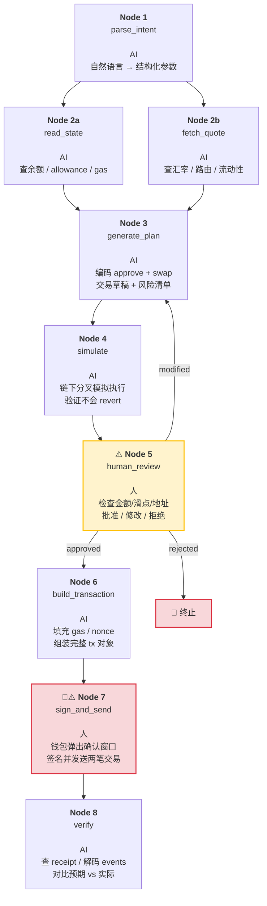

qin# 受限 Web3 Workflow — ERC-20 Swap 设计稿

> 文档状态：交付稿
> 作者：Calciux + Hermes Agent
> 日期：2026-05-30
>
> 设计过程详见 [设计过程.md](./设计过程.md)

---

## Task Graph



---

## 受限约束

| ✅ AI 可以做的 | ❌ AI 不能做的 |
|---------------|---------------|
| 规划操作步骤 | 接触私钥 / 助记词 / API Key |
| 解释参数含义与风险 | 绕过人工确认 |
| 生成交易草稿（编码参数） | 自动签名 |
| 检查链上执行结果 | 自动转账或合约写入 |
| 准备交易说明供人工审核 | 跳过人的复核 |

---

## 用户输入

用户以自然语言描述意图，Node 1 解析为结构化 Intent。后续所有节点只接收和输出结构化数据。

### Intent 字段

| 字段 | 类型 | 必填 | 默认值 | 说明 |
|------|------|:----:|--------|------|
| `tokenA` | address | ✅ | — | 支付代币合约地址 |
| `tokenB` | address | — | AI 解析 | 目标代币合约地址 |
| `amount` | uint256 | ✅ | — | 支付数量（按 tokenA 精度） |
| `chainId` | uint256 | ✅ | `11155111` | 目标链 ID |
| `slippage` | uint256 | — | `50`（0.5%） | 最大滑点（bps） |
| `maxApprove` | uint256 | — | = amount | approve 上限 |

### 解析示例

```
输入："帮我把 10 USDC 换成 ETH，滑点别超过 1%"
  → tokenA: 0xA0b8... (USDC)
    tokenB: 0x7b79... (WETH)
    amount: 10000000
    chainId: 11155111
    slippage: 100 (1%)
    maxApprove: 10000000
```

---

## 节点详细规格

### Node 1: parse_intent

| 项目 | 内容 |
|------|------|
| 输入 | 自然语言 |
| 输出 | `{tokenA, tokenB, amount, chainId, slippage, maxApprove}` |
| 工具 | AI 语义解析 + 合约地址映射表 |
| 失败 | 缺字段 → 回问；token 无法解析 → 列出候选 |

### Node 2a: read_state

| 项目 | 内容 |
|------|------|
| 输入 | `{tokenA, chainId}` |
| 输出 | `{balance, allowance, gasPrice}` |
| 工具 | `eth_call` → `balanceOf` / `allowance`；gas oracle |
| 失败 | RPC 无响应 → 切换备选；连续 3 次失败 → 提示网络不可用 |

### Node 2b: fetch_quote

| 项目 | 内容 |
|------|------|
| 输入 | `{tokenA, tokenB, amount, chainId}` |
| 输出 | `{quote, route, liquidity, priceImpact}` |
| 工具 | `eth_call` → Router.getAmountsOut / 链下聚合器 API |
| 失败 | 无可用路由 → 提示无交易池；流动性不足 → 标注冲击风险 |

> Node 2a 与 2b 互不依赖，可并行。

### Node 3: generate_plan

**两个交易结构体：**

| 结构体 | 目标合约 | 说明 |
|--------|----------|------|
| `approveTx` | tokenA 合约 | `approve(spender, amount)` — 授权 Router 扣款 |
| `swapTx` | Router 合约 | `swapExactTokensForTokens(...)` — 执行兑换 |

必须拆开：两个不同合约、不同 nonce、独立交易。合并会导致 Router 拿不到 allowance 直接 revert。

| 项目 | 内容 |
|------|------|
| 输入 | `{intent, walletState, spotData}` |
| 输出 | `{approveTx, swapTx, risks}` |
| 工具 | ABI 编码 + 函数选择器 + 滑点公式 |
| 失败 | 签名不匹配 → 检查 ABI；无路由 → 终止；allowance 不足 → 调高并标注 |

> 只设 to/data/value：gasLimit 由 Node 4 估算，gasPrice/nonce 由 Node 6 补全。

**risks 检测清单：**

| type | severity | 触发条件 |
|------|:--------:|----------|
| `approve-unlimited` | 🔴 高 | maxApprove = uint256 最大值 |
| `slippage-too-high` | 🟡 中 | slippage > 1% |
| `slippage-vs-impact` | 🔴 高 | priceImpact > slippage |
| `insufficient-balance` | 🔴 高 | balance < amount |
| `insufficient-allowance` | 🟡 中 | allowance < amount |
| `indirect-route` | 🟢 低 | route.length > 2 |
| `low-liquidity` | 🟡 中 | liquidity < amount × 10 |

### Node 4: simulate

| 项目 | 内容 |
|------|------|
| 输入 | `{approveTx, swapTx, chainId, state}` |
| 输出 | `{simSuccess, simResult, gasEstimate, warnings[]}` |
| 工具 | Tenderly / Anvil / eth_call 批量模拟 |
| 失败 | revert → 回 Node 3；偏差大 → 标注风险；API 不可用 → 跳过但标注 |

### Node 5: human_review ⚠️

| 项目 | 内容 |
|------|------|
| 输入 | `{plan, simResult, risks, route}` |
| 输出 | approved / modified / rejected |
| 工具 | 无——人为唯一执行者。AI 等待 |
| 失败 | rejected → 终止；modified → 回 Node 3；超时 → clean up |

**确认页展示：**

```
════════════════════════════════
  🔁 Swap 确认
════════════════════════════════
  📥 支付  10 USDC (0xA0b8...)
  📤 获得  ~0.00495 WETH (0x7b79...)
  🛣 路径  [USDC → WETH]  1 跳
  💧 滑点  0.5%
  ⛽ Gas    0.00015 ETH
  ✅ 模拟  通过
  ⚠️ 风险  N 项
  📋 步骤  1. approve  2. swap
  [✅ 确认]  [✏️ 修改]  [❌ 拒绝]
════════════════════════════════
```

### Node 6: build_transaction

| 项目 | 内容 |
|------|------|
| 输入 | `{confirmedParams, gasInfo}` |
| 输出 | `{tx1, tx2}`（含 gasLimit / gasPrice / nonce） |
| 工具 | `eth_estimateGas` / `eth_getTransactionCount` / `eth_gasPrice` |
| 失败 | estimateGas revert → 终止 |

### Node 7: sign_and_send 🔑

| 项目 | 内容 |
|------|------|
| 输入 | `{tx1, tx2}` |
| 输出 | `{txHash1, txHash2}` 或取消 |
| 工具 | 用户钱包 |
| 失败 | 拒签 → 终止；pending → 进 Node 8 轮询 |

### Node 8: verify

| 项目 | 内容 |
|------|------|
| 输入 | `{txHash1, txHash2}` |
| 输出 | `{success, actualAmount, slippageActual, events[], gasUsed}` |
| 工具 | `eth_getTransactionReceipt` + Transfer 事件解码 |
| 失败 | pending → 15s 轮询 × 5 分钟；reverted → 解析 reason；偏差 > 滑点 → 高亮 |

### 节点角色总览

| 节点 | 角色 | 说明 |
|------|:--:|------|
| parse_intent (1) | AI | 自然语言 → 结构化参数 |
| read_state (2a) | AI | RPC 读余额/allowance/gas |
| fetch_quote (2b) | AI | Router 查汇率/路由/流动性 |
| generate_plan (3) | AI | 编码两笔交易 + 风险清单 |
| simulate (4) | AI | 链下分叉模拟执行 |
| human_review (5) ⚠️ | **人** | 审核金额/滑点/授权/路径 |
| build_transaction (6) | AI | 补全 gas/nonce/deadline |
| sign_and_send (7) 🔑⚠️ | **人** | 钱包签名 + 发送 |
| verify (8) | AI | 解读链上收据 |

---

## 人工确认点

| 确认点 | 节点 | 原因 |
|--------|:----:|------|
| 复核交易草稿 | Node 5 | AI 可能算错 |
| 审核授权范围 | Node 5 | approve 对象与额度不能出错 |
| 确认滑点 | Node 5 | 太小失败、太大被套利 |
| 钱包签名 | Node 7 | 私钥不在 AI 手里 |

AI 不可代劳：接触私钥、签名交易、自动发交易到链上、跳过 Node 5 进入 Node 6。

---

## 结果验证

| 校验项 | 方法 | 执行者 |
|--------|------|:--:|
| 交易状态 | `getTransactionReceipt` → `status=1` | AI + 人 |
| 实际成交额 | 解码 Transfer.value → 对比 quote | AI |
| 滑点偏差 | `(quote - actual) / quote` | AI |
| 授权残留 | `allowance(用户, Router)` ≤ maxApprove | AI |
| 余额变化 | swap 前后各调 `balanceOf` | AI + 人 |

失败：pending → 轮询；reverted → 解析 reason；偏差超滑点 → MEV 警示。

---

## 风险与限制

| # | 风险 | 说明 |
|:--:|------|------|
| 1 | AI 不确定性 | AI 可能算错汇率/选错路由/编码错误 |
| 2 | 安全边界缺失 | 未声明白名单/限额时接近全自由 Agent |
| 3 | 链上状态延迟 | Node 2a → Node 7 间余额可能已变 |
| 4 | 网络依赖 | RPC 不可用或过期数据 |
| 5 | 测试网限定 | 仅小额 Sepolia 测试网 |

---

## 附录：节点依赖关系

```
Node 1 ──┬──→ Node 2a ──┬──→ Node 3 ──→ Node 4 ──→ Node 5 ──→ Node 6 ──→ Node 7 ──→ Node 8
         │  (parallel)   │      ↓         ↓         ⚠️         ↓         🔑⚠️        ↓
         └──→ Node 2b ──┘     AI        AI       人         AI        人         AI
                                                             ↓
                                                      reject → 终止
                                                      modify → 回到 Node 3
```

---

## 附录 A：完整参数表

### A.1 Node 1: parse_intent

**输出参数**

| 参数 | 类型 | 说明 |
|------|------|------|
| `tokenA` | address | 用户支付的源代币合约地址，如 USDC `0xA0b8...`。由 AI 根据用户自然语言中的代币名（"USDC"）映射为链上精确地址 |
| `tokenB` | address | 用户想换到的目标代币合约地址，如 WETH `0x7b79...`。若用户说"ETH"，AI 应映射为 WETH 地址 |
| `amount` | uint256 | 支付的 tokenA 数量，按 tokenA 合约的 decimals 精度表示。如 10 USDC（6 位精度）= `10000000` |
| `chainId` | uint256 | 目标链 ID。Sepolia = `11155111`。Node 2a/2b 用此值构造 RPC 请求 |
| `slippage` | uint256 | 允许的最大滑点，单位 bps（basis points）。`50` = 0.5%；`100` = 1%。若用户未指定，默认 50 |
| `maxApprove` | uint256 | approve 授权总额度上限，按 tokenA 精度。默认 = amount。严禁设为 `type(uint256).max`（无限授权） |

### A.2 Node 2a: read_state

**输入参数**

| 参数 | 类型 | 来源 | 说明 |
|------|------|------|------|
| `tokenA` | address | Node 1 | 源代币合约地址 |
| `chainId` | uint256 | Node 1 | 目标链 ID |

**输出参数**

| 参数 | 类型 | 说明 |
|------|------|------|
| `balance` | uint256 | 用户钱包当前持有的 tokenA 数量。通过 `balanceOf(用户地址)` 查询。若小于 amount，Node 3 将标记 `insufficient-balance` |
| `allowance` | uint256 | 用户已授权给 DEX Router 的 tokenA 额度。通过 `allowance(用户地址, Router地址)` 查询。若小于 amount，Node 3 将标记 `insufficient-allowance` |
| `gasPrice` | uint256 | 链上当前 gas 价格（单位 wei），通过 gas oracle 或 `eth_gasPrice` 获取。传给 Node 6 直接使用 |

### A.3 Node 2b: fetch_quote

**输入参数**

| 参数 | 类型 | 来源 | 说明 |
|------|------|------|------|
| `tokenA` | address | Node 1 | 源代币合约地址 |
| `tokenB` | address | Node 1 | 目标代币合约地址 |
| `amount` | uint256 | Node 1 | 兑换数量 |
| `chainId` | uint256 | Node 1 | 目标链 ID |

**输出参数**

| 参数 | 类型 | 说明 |
|------|------|------|
| `quote` | uint256 | 按当前池子状态算出的预期成交金额（tokenB 数量）。通过 Router.getAmountsOut 获取。此值具有时效性——拿到后到用户签名间池子可能已变动 |
| `route` | address[] | 最优兑换路径的代币地址数组。直接配对如 `[USDC地址, WETH地址]`；间接配对如 `[PEPE地址, WETH地址, SUSHI地址]`。每多一跳多一份手续费 |
| `liquidity` | uint256 | 池子深度（tokenA 侧储备量）。用于 Node 3 计算价格冲击。若 `liquidity < amount × 10`，标记 `low-liquidity` |
| `priceImpact` | float | 价格冲击百分比，公式 = `amount / (liquidity + amount) × 100%`。若 `priceImpact > slippage`，Node 3 标记 `slippage-vs-impact` |

### A.4 Node 3: generate_plan

**输入参数**

| 参数 | 类型 | 来源 | 说明 |
|------|------|------|------|
| `intent` | dict | Node 1 | 用户兑换意图：`{tokenA, tokenB, amount, chainId, slippage, maxApprove}` |
| `walletState` | dict | Node 2a | 用户链上状态快照：`{balance, allowance, gasPrice}` |
| `spotData` | dict | Node 2b | 市场数据快照：`{quote, route, liquidity, priceImpact}` |

**输出参数**

| 参数 | 类型 | 说明 |
|------|------|------|
| `approveTx.to` | address | **tokenA 合约地址**。交易发送给 tokenA 合约以执行 `approve` |
| `approveTx.data` | bytes | `keccak256("approve(address,uint256)")` 前 4 字节 + ABI 编码的 `(Router地址, amount)`。amount 取自 maxApprove |
| `approveTx.value` | uint256 | 固定为 0。approve 仅修改 allowance mapping，不涉及 ETH 转移 |
| `swapTx.to` | address | **DEX Router 合约地址**。交易发送给 Router 以执行 swap |
| `swapTx.data` | bytes | `keccak256("swapExactTokensForTokens(uint256,uint256,address[],address,uint256)")` 前 4 字节 + ABI 编码参数。其中 `amountOutMin = quote × (1 - slippage)`，`path = route`，`deadline = 当前时间 + 20分钟` |
| `swapTx.value` | uint256 | 固定为 0。tokenA → tokenB 的 swap 不涉及 ETH 转移（ETH→token 时才有 value） |
| `risks[]` | array | 风险条目列表，每项 `{type: string, severity: "高"\|"中"\|"低", detail: string}`。用于 Node 5 确认页展示 |

> gasLimit 不在本节点输出：由 Node 4 模拟后估算。gasPrice 和 nonce 不在本节点输出：由 Node 6 查询链上实值后填入。

### A.5 Node 4: simulate

**输入参数**

| 参数 | 类型 | 来源 | 说明 |
|------|------|------|------|
| `approveTx` | tx | Node 3 | 含 `{to, data, value}` 的 approve 交易草稿 |
| `swapTx` | tx | Node 3 | 含 `{to, data, value}` 的 swap 交易草稿 |
| `chainId` | uint256 | Node 1 | 目标链 ID，分叉时使用对应链的分叉环境 |
| `state` | dict | Node 2a | 余额和 allowance，确保模拟环境初始状态与用户实际状态一致 |

**输出参数**

| 参数 | 类型 | 说明 |
|------|------|------|
| `simSuccess` | bool | `true` = 模拟执行未 revert。`false` = 交易在当前链上状态下会失败，需输出 revert reason 并回到 Node 3 |
| `simResult` | uint256 | 模拟实际成交的 tokenB 数量。与 `quote` 对比计算偏差百分比 |
| `gasEstimate` | uint256 | 模拟后估算的 gas 消耗量（wei）。传给 Node 6 作为 `gasLimit` 的参考值 |
| `warnings[]` | array | 模拟过程中的警告，如严重价格偏离、过高的滑点实现、非标准 ERC-20 行为 |

### A.6 Node 5: human_review

**输入参数**

| 参数 | 类型 | 来源 | 说明 |
|------|------|------|------|
| `plan` | dict | Node 3 | 交易草稿：`{approveTx: {to, data, value}, swapTx: {to, data, value}}` |
| `simResult` | simResult | Node 4 | 模拟结果：`{simSuccess, simResult, gasEstimate, warnings[]}` |
| `risks` | array | Node 3 | 风险清单，用于确认页的 "⚠️ 风险" 展示 |
| `route` | address[] | Node 2b | 兑换路径数组，用于确认页的 "🛣 路径" 展示 |

**输出参数**

| 参数 | 类型 | 说明 |
|------|------|------|
| `status` | enum | `approved` — 批准，进入 Node 6；`modified` — 用户修改了参数（slippage / maxApprove / amount），回到 Node 3 重新生成；`rejected` — 拒绝，终止 Workflow |
| `changes` | dict | 仅在 status = modified 时存在。含用户修改的字段，如 `{slippage: 100, maxApprove: 5000000}` |
| `reason` | string | 仅在 status = rejected 时存在。用户拒绝的原因 |

### A.7 Node 6: build_transaction

**输入参数**

| 参数 | 类型 | 来源 | 说明 |
|------|------|------|------|
| `confirmedParams` | dict | Node 5 | 用户确认后的最终参数（若用户修改，含修改后的值） |
| `gasInfo` | dict | Node 4 + Node 2a | 含 `gasEstimate`（来自 Node 4）+ 实时 `gasPrice`（来自 Node 2a，可能已更新） |

**输出参数**

| 参数 | 类型 | 说明 |
|------|------|------|
| `tx1.to` | address | **tokenA 合约地址**。approve 交易的接收方，与 Node 3 的 approveTx.to 一致 |
| `tx1.data` | bytes | approve 编码数据，与 Node 3 的 approveTx.data 一致 |
| `tx1.gasLimit` | uint256 | approve 交易的 gas 上限，取值 = `max(gasEstimate × 1.2, 21000)` |
| `tx2.to` | address | **Router 合约地址**。swap 交易的接收方，与 Node 3 的 swapTx.to 一致 |
| `tx2.data` | bytes | swap 编码数据，与 Node 3 的 swapTx.data 一致 |
| `tx2.gasLimit` | uint256 | swap 交易的 gas 上限 |
| `gasPrice` | uint256 | 当前链上 gas 价格（wei），再取一次最新值以应对 Node 2a 到现在的延迟 |
| `nonce` | uint256 | 用户当前交易序号。两笔交易使用连续 nonce（approve = N, swap = N+1）。若 Node 6 与 Node 7 之间用户发了其他交易，nonce 会冲突 |

### A.8 Node 7: sign_and_send 🔑

**输入参数**

| 参数 | 类型 | 来源 | 说明 |
|------|------|------|------|
| `tx1` | tx | Node 6 | 完整的 approve 交易对象：`{to, data, value, gasLimit, gasPrice, nonce}` |
| `tx2` | tx | Node 6 | 完整的 swap 交易对象：`{to, data, value, gasLimit, gasPrice, nonce}`（nonce = tx1.nonce + 1） |

**输出参数**

| 参数 | 类型 | 说明 |
|------|------|------|
| `txHash1` | bytes32 | approve 交易在链上广播后返回的交易哈希，用于 Node 8 查询收据 |
| `txHash2` | bytes32 | swap 交易哈希（紧跟 approve 之后发送） |

> 本节点全部由人通过钱包操作。若用户拒签，返回 cancellation 而非 txHash，Workflow 终止。

### A.9 Node 8: verify

**输入参数**

| 参数 | 类型 | 来源 | 说明 |
|------|------|------|------|
| `txHash1` | bytes32 | Node 7 | approve 交易哈希 |
| `txHash2` | bytes32 | Node 7 | swap 交易哈希 |

**输出参数**

| 参数 | 类型 | 说明 |
|------|------|------|
| `success` | bool | 两笔交易都 `status=1` = true。任一失败为 false |
| `actualAmount` | uint256 | 从 swap 交易的 Transfer 事件中解码出的实际 tokenB 到账金额。事件格式：`Transfer(池子地址, 用户地址, 金额)` |
| `slippageActual` | float | 实际滑点 = `(quote - actualAmount) / quote`。若 > 用户设定 slippage，交易将 revert（由 amountOutMin 保护），此时 slippageActual 无意义 |
| `events[]` | array | 解码后的事件列表：`{from, to, value}`。包含 approve 的 Approval 事件和 swap 的 1-2 个 Transfer 事件 |
| `gasUsed` | uint256 | 两笔交易实际合计 gas 消耗（wei） |
